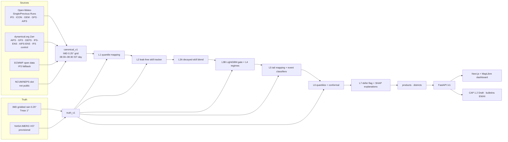

# TRUSTCAST

**Hybrid AI–NWP multi-model forecast blending for India** · Smart India Hackathon 2026, problem
statement **SIH26081** (NCMRWF, Ministry of Earth Sciences; theme Disaster Management).

> **Decision-support tool. Not an official warning.**

TRUSTCAST learns, from verification against IMD observations, which weather model to trust for each
place, season, lead time and weather regime. It blends the models into one bias-corrected forecast
with calibrated uncertainty, protects heavy-rain and heat extremes, explains its choices per
district, and serves everything through a REST API and a web dashboard.

## Status (see `WORK.md` for the dated log)

| Phase | State |
|---|---|
| 0 Foundations, 00/12Z archiver | done; runs under Windows Task Scheduler |
| 1 Source adapters, IMD/IMERG truth, IMD-day alignment | done |
| 2 Baselines + verification harness | code done; scoreboard waits for the development backfill |
| 3-5 Bias correction, skill tracker, blenders A/B, regimes, extremes, uncertainty, explanations | code done and tested; results wait for the backfill |
| 6 API + dashboard | done (contract tests pass; `npm run build` passes) |
| 7 Replays, bulletins (EN/HI), overrides, CAP | done; replays rebuilt weekly as data arrives |
| 8 Frozen 2026 test | `scripts/run_final_test.py` ready; blocked until 2026 data and IMD 2026 truth exist |

No metric appears anywhere in this repository unless it was computed from real data by the scripts
below. Development-split results land in `reports/`; the frozen 2026 test is run exactly once.

## Architecture



Every learned layer is refitted quarterly on data verified **before** the quarter starts, and the
skill tracker only uses IMD windows that ended before the forecast was issued (unit-tested).

## Quick start

```bash
py -3.12 -m venv .venv
```
```bash
.venv/Scripts/python -m pip install -r requirements.txt
```
```bash
.venv/Scripts/python -m pytest -q
```

Data pipeline (each command is resumable; the scheduled versions are in `scripts/ops/`):

| Command | What it does |
|---|---|
| `python scripts/archive_run.py` | snapshot the latest 00/12Z runs (Open-Meteo Single Runs) with SHA-256 manifests |
| `python scripts/backfill_canonical.py --kind dyn` / `--kind prev` | monthly canonical stores for 2024–2025 (add `--collect-test` for 2026) |
| `python scripts/build_truth.py` | monthly IMD (+IMERG provisional) truth |
| `python scripts/download_imd_history.py --start 1991 --end 2023` | IMD normal for the climatology baseline |
| `python scripts/run_verification.py` | Phase 2 scoreboard → `reports/phase2/` |
| `python scripts/run_experiments.py` | Phases 3–5: tune, gate each layer, ablate → `reports/phase3-5/`, `config/model_selection.yaml` |
| `python scripts/build_replays.py` | event replays (Wayanad 2024, Vidarbha heat 2024, Fengal remnants 2024) |
| `python scripts/run_forecast.py` | live products for the newest runs |
| `python scripts/run_final_test.py --dry-run` | Phase 8 preconditions (the real run is allowed once) |

Scheduling on Windows: `powershell -ExecutionPolicy Bypass -File scripts/ops/register_tasks.ps1`
registers archive (4×/day), backfills, truth, forecast (daily) and a weekly verification/experiment
job under `\TRUSTCAST\`; `unregister_tasks.ps1` removes them. Logs: `data/logs/task_*.log`.

Serve:

```bash
.venv/Scripts/python -m uvicorn trustcast.api.app:app --port 8000
```
```bash
cd web && npm install && npm run dev
```

API docs at `http://localhost:8000/docs` (OpenAPI). Or `docker compose up` (API + web; data mounted).

## Repository map

`CLAUDE.md` (rules, architecture, contracts) · `TODO.md` · `WORK.md` (dated log) ·
`DATA_SOURCES.md` (every source, access date, licence) · `config/` · `src/trustcast/` · `scripts/` ·
`tests/` (fixtures are synthetic and labelled) · `web/` · `reports/` · `docs/DEMO.md`.

## Honest limitations

- Pilot regions only (Kerala + coastal Karnataka; Vidarbha). The design is national; the free-tier
  Open-Meteo quota limits how many points can be backfilled.
- ICON, GEM and IFS HRES history come from Open-Meteo Previous Runs, which is ~11.5 h staler than a
  true 00Z run at the same lead; GEM stopped updating on 2026-05-26.
- IMD Tmax is 1° and interpolated to 0.25°. IMD 2026 gridded files are not yet downloadable, so 2026
  truth is IMERG-provisional until they are.
- NCMRWF NCUM/NEPS output is not public; the adapter slot exists.
- In the Wayanad (30 Jul 2024) replay the blend under-forecast the extreme (district mean 121.7 mm
  observed); the learned extreme layer only starts from Oct 2024 training data.

## Attribution

Forecast data: Open-Meteo.com (CC BY 4.0) with model data from ECMWF, NOAA/NCEP, DWD and ECCC;
dynamical.org (CC BY 4.0); ECMWF open data (CC BY 4.0). Observations: India Meteorological Department
gridded data; NASA GPM IMERG V07 (via dynamical.org, CC BY 4.0). Boundaries: geoBoundaries (Runfola et
al. 2020) India ADM2 (ODbL 1.0), ADM1 from DataMeet (CC BY 2.5 IN). Basemap: OpenFreeMap, © OpenMapTiles,
data © OpenStreetMap contributors.
