# Phase 2 baseline scoreboard (development period)

Generated 2026-09-30 18:44 UTC by `python scripts/run_verification.py`.

> Decision-support tool. Not an official warning.

All scores pooled over IMD land cells and 00Z inits; 95 % intervals from a paired block bootstrap
(5-day blocks). `Δ vs equal_mean` < 0 means lower error than the equal-weight mean;
**bold** = the 95 % interval excludes 0. Frozen 2026 test data were not read.

Samples: **main** = valid days from 2024-04-01, all forecasts except AIFS-ENS; **late** =
valid days from 2025-07-02 (AIFS-ENS era), all forecasts. Within a sample and lead, every
row is scored on the same cases (all listed forecasts and the observation valid).

## Data coverage

| region     | variable   | forecast       | first_init          | last_init           |   n_inits |   members |
|:-----------|:-----------|:---------------|:--------------------|:--------------------|----------:|----------:|
| rain_pilot | precip     | ecmwf_ifs      | NaT                 | NaT                 |         0 |         1 |
| rain_pilot | precip     | ecmwf_ifs_ctrl | 2024-04-01 00:00:00 | 2025-12-26 00:00:00 |       635 |         1 |
| rain_pilot | precip     | dwd_icon       | 2024-01-20 00:00:00 | 2024-01-31 00:00:00 |        12 |         1 |
| rain_pilot | precip     | cmc_gem        | 2024-01-20 00:00:00 | 2024-01-31 00:00:00 |        12 |         1 |
| rain_pilot | precip     | ecmwf_aifs     | 2024-04-01 00:00:00 | 2025-12-26 00:00:00 |       635 |         1 |
| rain_pilot | precip     | ncep_gfs       | 2024-01-01 00:00:00 | 2025-12-26 00:00:00 |       726 |         1 |
| rain_pilot | precip     | ncep_gefs      | 2024-01-01 00:00:00 | 2024-04-30 00:00:00 |       121 |        31 |
| rain_pilot | precip     | ecmwf_ifs_ens  | 2024-04-01 00:00:00 | 2025-12-26 00:00:00 |       635 |        51 |
| rain_pilot | precip     | ecmwf_aifs_ens | 2025-07-02 00:00:00 | 2025-12-26 00:00:00 |       178 |        51 |
| rain_pilot | tmax       | ecmwf_ifs      | NaT                 | NaT                 |         0 |         1 |
| rain_pilot | tmax       | ecmwf_ifs_ctrl | 2024-04-01 00:00:00 | 2025-12-26 00:00:00 |       635 |         1 |
| rain_pilot | tmax       | dwd_icon       | 2024-01-20 00:00:00 | 2024-01-31 00:00:00 |        12 |         1 |
| rain_pilot | tmax       | cmc_gem        | 2024-01-20 00:00:00 | 2024-01-31 00:00:00 |        12 |         1 |
| rain_pilot | tmax       | ecmwf_aifs     | 2024-04-01 00:00:00 | 2025-12-26 00:00:00 |       635 |         1 |
| rain_pilot | tmax       | ncep_gfs       | 2024-01-01 00:00:00 | 2025-12-26 00:00:00 |       726 |         1 |
| rain_pilot | tmax       | ncep_gefs      | 2024-01-01 00:00:00 | 2024-04-30 00:00:00 |       121 |        31 |
| rain_pilot | tmax       | ecmwf_ifs_ens  | 2024-04-01 00:00:00 | 2025-12-26 00:00:00 |       635 |        51 |
| rain_pilot | tmax       | ecmwf_aifs_ens | 2025-07-02 00:00:00 | 2025-12-26 00:00:00 |       178 |        51 |
| heat_pilot | precip     | ecmwf_ifs_ctrl | 2024-04-01 00:00:00 | 2025-12-26 00:00:00 |       635 |         1 |
| heat_pilot | precip     | dwd_icon       | 2025-10-01 00:00:00 | 2025-10-31 00:00:00 |        31 |         1 |
| heat_pilot | precip     | ecmwf_aifs     | 2024-04-01 00:00:00 | 2025-12-26 00:00:00 |       635 |         1 |
| heat_pilot | precip     | ncep_gfs       | 2024-01-01 00:00:00 | 2025-12-26 00:00:00 |       726 |         1 |
| heat_pilot | precip     | ncep_gefs      | 2024-01-01 00:00:00 | 2025-10-31 00:00:00 |       122 |        31 |
| heat_pilot | precip     | ecmwf_ifs_ens  | 2024-04-01 00:00:00 | 2025-12-26 00:00:00 |       635 |        51 |
| heat_pilot | precip     | ecmwf_aifs_ens | 2025-07-02 00:00:00 | 2025-12-26 00:00:00 |       178 |        51 |
| heat_pilot | tmax       | ecmwf_ifs_ctrl | 2024-04-01 00:00:00 | 2025-12-26 00:00:00 |       635 |         1 |
| heat_pilot | tmax       | dwd_icon       | 2025-10-01 00:00:00 | 2025-10-31 00:00:00 |        31 |         1 |
| heat_pilot | tmax       | ecmwf_aifs     | 2024-04-01 00:00:00 | 2025-12-26 00:00:00 |       635 |         1 |
| heat_pilot | tmax       | ncep_gfs       | 2024-01-01 00:00:00 | 2025-12-26 00:00:00 |       726 |         1 |
| heat_pilot | tmax       | ncep_gefs      | 2024-01-01 00:00:00 | 2025-10-31 00:00:00 |       122 |        31 |
| heat_pilot | tmax       | ecmwf_ifs_ens  | 2024-04-01 00:00:00 | 2025-12-26 00:00:00 |       635 |        51 |
| heat_pilot | tmax       | ecmwf_aifs_ens | 2025-07-02 00:00:00 | 2025-12-26 00:00:00 |       178 |        51 |

Forecasts left out of a sample (coverage below 50 % of the best, shown as fraction):

- main/rain_pilot/precip: {'ecmwf_ifs': 0.0, 'dwd_icon': 0.0, 'cmc_gem': 0.0, 'ncep_gefs': 0.049}
- late/rain_pilot/precip: {'ecmwf_ifs': 0.0, 'dwd_icon': 0.0, 'cmc_gem': 0.0, 'ncep_gefs': 0.0}
- main/rain_pilot/tmax: {'ecmwf_ifs': 0.0, 'dwd_icon': 0.0, 'cmc_gem': 0.0, 'ncep_gefs': 0.049}
- late/rain_pilot/tmax: {'ecmwf_ifs': 0.0, 'dwd_icon': 0.0, 'cmc_gem': 0.0, 'ncep_gefs': 0.0}
- main/heat_pilot/precip: {'dwd_icon': 0.049, 'ncep_gefs': 0.05}
- late/heat_pilot/precip: {'dwd_icon': 0.173, 'ncep_gefs': 0.173}
- main/heat_pilot/tmax: {'dwd_icon': 0.049, 'ncep_gefs': 0.05}
- late/heat_pilot/tmax: {'dwd_icon': 0.173, 'ncep_gefs': 0.173}

## [late] heat_pilot · precip (mm/day) · all seasons

| forecast | lead | n | RMSE [95 % CI] | Δ RMSE vs equal_mean [CI] | CRPS [CI] | bias |
|---|---|---|---|---|---|---|
| climatology | 1 | 24,843 | 14.21 [9.69, 18.42] | **3.30 [1.52, 5.28]** | 6.65 [4.50, 8.87] | -1.17 |
| ecmwf_aifs | 1 | 24,843 | 10.70 [7.56, 13.34] | **-0.22 [-0.46, -0.02]** | 4.82 [3.08, 6.60] | 0.35 |
| ecmwf_aifs_ens | 1 | 24,843 | 10.78 [7.58, 13.48] | -0.14 [-0.46, 0.14] | 3.37 [2.15, 4.66] | -0.33 |
| ecmwf_ifs_ctrl | 1 | 24,843 | 13.30 [9.28, 16.65] | **2.38 [1.31, 3.36]** | 5.68 [3.64, 7.80] | 0.95 |
| ecmwf_ifs_ens | 1 | 24,843 | 10.82 [7.72, 13.54] | -0.09 [-0.46, 0.21] | 3.48 [2.22, 4.79] | 0.38 |
| equal_mean | 1 | 24,843 | 10.92 [7.84, 13.52] | n/a | 4.98 [3.23, 6.79] | 0.53 |
| ncep_gfs | 1 | 24,843 | 15.21 [10.56, 19.41] | **4.29 [1.94, 6.60]** | 6.40 [4.05, 8.81] | 1.30 |
| persistence | 1 | 24,843 | 19.28 [12.97, 25.40] | **8.36 [4.72, 12.29]** | 8.53 [5.18, 12.03] | 0.22 |
| superensemble | 1 | 24,843 | 10.95 [7.58, 13.90] | 0.04 [-0.45, 0.60] | 5.05 [3.56, 6.60] | -1.07 |
| climatology | 2 | 24,843 | 14.20 [9.65, 18.36] | **2.68 [0.90, 4.95]** | 6.62 [4.49, 8.88] | -1.16 |
| ecmwf_aifs | 2 | 24,843 | 11.85 [8.39, 14.81] | 0.32 [-0.55, 1.20] | 5.72 [3.69, 7.80] | 1.39 |
| ecmwf_aifs_ens | 2 | 24,843 | 11.58 [8.04, 14.54] | 0.06 [-0.81, 0.92] | 3.73 [2.34, 5.17] | 0.68 |
| ecmwf_ifs_ctrl | 2 | 24,843 | 14.66 [9.64, 19.11] | **3.13 [0.87, 5.56]** | 6.28 [3.98, 8.76] | 1.53 |
| ecmwf_ifs_ens | 2 | 24,843 | 11.71 [8.38, 14.44] | 0.19 [-0.19, 0.55] | 3.75 [2.38, 5.15] | 1.46 |
| equal_mean | 2 | 24,843 | 11.52 [8.20, 14.15] | n/a | 5.51 [3.51, 7.49] | 1.30 |
| ncep_gfs | 2 | 24,843 | 14.62 [10.46, 18.46] | **3.10 [1.60, 4.52]** | 6.60 [4.15, 9.32] | 1.46 |
| persistence | 2 | 24,843 | 20.12 [13.88, 26.59] | **8.60 [4.86, 13.34]** | 8.93 [5.65, 12.50] | 0.26 |
| superensemble | 2 | 24,843 | 11.45 [7.94, 14.41] | -0.08 [-0.95, 0.78] | 5.56 [3.89, 7.29] | -0.34 |
| climatology | 3 | 24,843 | 14.19 [9.63, 18.38] | **2.30 [0.82, 3.80]** | 6.59 [4.41, 8.88] | -1.15 |
| ecmwf_aifs | 3 | 24,843 | 11.76 [8.39, 14.69] | -0.13 [-0.46, 0.21] | 5.81 [3.72, 7.90] | 1.41 |
| ecmwf_aifs_ens | 3 | 24,843 | 11.88 [8.32, 14.97] | -0.01 [-0.33, 0.34] | 3.84 [2.41, 5.32] | 0.89 |
| ecmwf_ifs_ctrl | 3 | 24,843 | 14.38 [10.44, 18.16] | **2.50 [0.80, 4.84]** | 6.15 [3.81, 8.50] | 1.07 |
| ecmwf_ifs_ens | 3 | 24,843 | 11.73 [8.30, 14.77] | -0.15 [-0.46, 0.13] | 3.67 [2.33, 5.08] | 1.18 |
| equal_mean | 3 | 24,843 | 11.89 [8.31, 14.84] | n/a | 5.64 [3.60, 7.73] | 1.02 |
| ncep_gfs | 3 | 24,843 | 16.12 [11.07, 20.20] | **4.24 [2.74, 5.51]** | 7.10 [4.44, 9.89] | 0.56 |
| persistence | 3 | 24,843 | 20.54 [15.32, 25.62] | **8.65 [5.67, 11.54]** | 9.38 [6.07, 12.81] | 0.32 |
| superensemble | 3 | 24,843 | 11.57 [8.01, 14.59] | **-0.32 [-0.57, -0.09]** | 5.82 [4.12, 7.63] | -0.38 |
| climatology | 4 | 24,843 | 14.18 [9.65, 18.37] | **2.11 [0.89, 3.40]** | 6.56 [4.33, 8.82] | -1.17 |
| ecmwf_aifs | 4 | 24,843 | 11.98 [8.36, 15.26] | -0.09 [-0.53, 0.35] | 5.83 [3.73, 7.97] | 1.28 |
| ecmwf_aifs_ens | 4 | 24,843 | 12.02 [8.37, 15.29] | -0.05 [-0.49, 0.41] | 3.86 [2.46, 5.36] | 0.88 |
| ecmwf_ifs_ctrl | 4 | 24,843 | 14.46 [9.78, 18.55] | **2.39 [1.11, 3.60]** | 6.26 [3.89, 8.79] | 0.62 |
| ecmwf_ifs_ens | 4 | 24,843 | 12.35 [8.40, 15.76] | 0.28 [-0.12, 0.74] | 3.77 [2.37, 5.32] | 0.67 |
| equal_mean | 4 | 24,843 | 12.07 [8.34, 15.28] | n/a | 5.61 [3.59, 7.70] | 0.69 |
| ncep_gfs | 4 | 24,843 | 15.77 [10.97, 19.72] | **3.70 [2.06, 5.59]** | 6.69 [4.12, 9.20] | -0.02 |
| persistence | 4 | 24,843 | 20.46 [15.47, 25.01] | **8.39 [5.29, 11.65]** | 9.38 [6.26, 12.61] | 0.35 |
| superensemble | 4 | 24,843 | 11.88 [8.14, 15.13] | -0.20 [-0.54, 0.10] | 5.91 [4.21, 7.77] | -0.53 |
| climatology | 5 | 24,843 | 14.15 [9.61, 18.29] | **1.49 [0.66, 2.19]** | 6.52 [4.29, 8.71] | -1.14 |
| ecmwf_aifs | 5 | 24,843 | 12.61 [8.48, 16.67] | -0.05 [-0.69, 0.46] | 5.93 [3.68, 8.21] | 1.12 |
| ecmwf_aifs_ens | 5 | 24,843 | 12.44 [8.42, 16.34] | -0.22 [-0.62, 0.15] | 3.88 [2.40, 5.44] | 0.78 |
| ecmwf_ifs_ctrl | 5 | 24,843 | 14.81 [9.88, 19.29] | **2.15 [1.23, 3.02]** | 6.37 [3.93, 8.93] | 0.11 |
| ecmwf_ifs_ens | 5 | 24,843 | 12.58 [8.65, 15.95] | -0.08 [-0.65, 0.44] | 3.86 [2.41, 5.41] | 0.47 |
| equal_mean | 5 | 24,843 | 12.66 [8.49, 16.60] | n/a | 5.79 [3.57, 8.03] | 0.48 |
| ncep_gfs | 5 | 24,843 | 15.54 [10.33, 19.67] | **2.88 [1.48, 4.31]** | 6.71 [4.08, 9.36] | -0.07 |
| persistence | 5 | 24,843 | 20.56 [15.66, 25.01] | **7.90 [4.50, 11.70]** | 9.43 [6.43, 12.56] | 0.42 |
| superensemble | 5 | 24,843 | 12.33 [8.30, 16.05] | **-0.33 [-0.56, -0.04]** | 6.14 [4.32, 8.02] | -0.70 |

### Events ≥ 64.5 mm · all seasons

| forecast | lead | obs events | ETS [95 % CI] | POD | FAR | freq. bias | BSS vs clim [CI] |
|---|---|---|---|---|---|---|---|
| climatology | 1 | 322 | 0.000 [0.000, 0.000] | 0.00 | n/a | 0.00 | -0.03 [-0.04, 0.01] |
| ecmwf_aifs | 1 | 322 | 0.111 [0.000, 0.218] | 0.11 | 0.18 | 0.14 | 0.07 [-0.03, 0.17] |
| ecmwf_aifs_ens | 1 | 322 | 0.067 [0.000, 0.148] | 0.07 | 0.04 | 0.07 | 0.16 [0.03, 0.28] |
| ecmwf_ifs_ctrl | 1 | 322 | 0.127 [0.022, 0.225] | 0.18 | 0.66 | 0.52 | -0.20 [-0.45, -0.04] |
| ecmwf_ifs_ens | 1 | 322 | 0.124 [0.018, 0.222] | 0.13 | 0.31 | 0.19 | 0.17 [0.03, 0.29] |
| equal_mean | 1 | 322 | 0.150 [0.005, 0.292] | 0.17 | 0.36 | 0.26 | 0.05 [-0.12, 0.20] |
| ncep_gfs | 1 | 322 | 0.145 [0.022, 0.289] | 0.25 | 0.73 | 0.93 | -0.46 [-1.30, 0.04] |
| persistence | 1 | 322 | 0.011 [-0.002, 0.021] | 0.03 | 0.97 | 1.02 | -1.01 [-1.20, -0.79] |
| superensemble | 1 | 322 | 0.052 [0.000, 0.109] | 0.05 | 0.11 | 0.06 | 0.02 [-0.03, 0.07] |
| climatology | 2 | 322 | 0.000 [0.000, 0.000] | 0.00 | n/a | 0.00 | -0.03 [-0.04, 0.01] |
| ecmwf_aifs | 2 | 322 | 0.098 [0.000, 0.173] | 0.11 | 0.37 | 0.17 | 0.02 [-0.10, 0.11] |
| ecmwf_aifs_ens | 2 | 322 | 0.024 [0.000, 0.042] | 0.02 | 0.20 | 0.03 | 0.12 [-0.00, 0.25] |
| ecmwf_ifs_ctrl | 2 | 322 | 0.069 [0.015, 0.126] | 0.11 | 0.81 | 0.57 | -0.39 [-1.17, -0.04] |
| ecmwf_ifs_ens | 2 | 322 | 0.080 [-0.000, 0.176] | 0.10 | 0.64 | 0.27 | 0.11 [-0.10, 0.26] |
| equal_mean | 2 | 322 | 0.134 [-0.000, 0.293] | 0.16 | 0.47 | 0.29 | -0.01 [-0.37, 0.23] |
| ncep_gfs | 2 | 322 | 0.151 [0.019, 0.320] | 0.28 | 0.74 | 1.06 | -0.54 [-1.56, 0.05] |
| persistence | 2 | 322 | -0.002 [-0.010, 0.006] | 0.01 | 0.99 | 1.02 | -1.06 [-1.62, -0.76] |
| superensemble | 2 | 322 | 0.072 [0.000, 0.142] | 0.07 | 0.20 | 0.09 | 0.03 [-0.05, 0.11] |
| climatology | 3 | 322 | 0.000 [0.000, 0.000] | 0.00 | n/a | 0.00 | -0.03 [-0.04, 0.01] |
| ecmwf_aifs | 3 | 322 | 0.100 [0.000, 0.210] | 0.11 | 0.28 | 0.15 | 0.04 [-0.03, 0.12] |
| ecmwf_aifs_ens | 3 | 322 | 0.003 [0.000, 0.007] | 0.00 | 0.50 | 0.01 | 0.10 [-0.01, 0.21] |
| ecmwf_ifs_ctrl | 3 | 322 | 0.114 [0.015, 0.200] | 0.17 | 0.71 | 0.58 | -0.27 [-0.82, -0.01] |
| ecmwf_ifs_ens | 3 | 322 | 0.079 [0.000, 0.156] | 0.09 | 0.45 | 0.16 | 0.14 [0.01, 0.28] |
| equal_mean | 3 | 322 | 0.034 [-0.000, 0.058] | 0.04 | 0.60 | 0.09 | -0.05 [-0.13, 0.01] |
| ncep_gfs | 3 | 322 | 0.045 [0.009, 0.067] | 0.08 | 0.88 | 0.70 | -0.58 [-1.15, -0.25] |
| persistence | 3 | 322 | 0.004 [-0.007, 0.019] | 0.02 | 0.98 | 1.02 | -1.03 [-2.29, -0.60] |
| superensemble | 3 | 322 | 0.054 [0.000, 0.118] | 0.06 | 0.18 | 0.07 | 0.02 [-0.03, 0.07] |
| climatology | 4 | 322 | 0.000 [0.000, 0.000] | 0.00 | n/a | 0.00 | -0.03 [-0.04, 0.01] |
| ecmwf_aifs | 4 | 322 | 0.068 [0.000, 0.133] | 0.08 | 0.58 | 0.19 | -0.06 [-0.10, 0.01] |
| ecmwf_aifs_ens | 4 | 322 | 0.000 [0.000, 0.000] | 0.00 | n/a | 0.00 | 0.09 [0.00, 0.15] |
| ecmwf_ifs_ctrl | 4 | 322 | 0.119 [-0.001, 0.215] | 0.17 | 0.70 | 0.58 | -0.27 [-0.63, -0.04] |
| ecmwf_ifs_ens | 4 | 322 | 0.009 [-0.000, 0.031] | 0.01 | 0.77 | 0.04 | 0.06 [-0.05, 0.15] |
| equal_mean | 4 | 322 | 0.081 [0.000, 0.155] | 0.09 | 0.49 | 0.18 | -0.02 [-0.25, 0.11] |
| ncep_gfs | 4 | 322 | 0.080 [0.014, 0.153] | 0.12 | 0.77 | 0.51 | -0.31 [-0.80, 0.04] |
| persistence | 4 | 322 | -0.004 [-0.008, 0.004] | 0.01 | 0.99 | 1.02 | -1.07 [-3.29, -0.39] |
| superensemble | 4 | 322 | 0.045 [0.000, 0.097] | 0.05 | 0.29 | 0.07 | 0.00 [-0.03, 0.04] |
| climatology | 5 | 321 | 0.000 [0.000, 0.000] | 0.00 | n/a | 0.00 | -0.03 [-0.04, 0.01] |
| ecmwf_aifs | 5 | 321 | 0.021 [0.000, 0.038] | 0.03 | 0.87 | 0.21 | -0.19 [-0.39, 0.01] |
| ecmwf_aifs_ens | 5 | 321 | 0.000 [0.000, 0.000] | 0.00 | n/a | 0.00 | 0.03 [-0.01, 0.05] |
| ecmwf_ifs_ctrl | 5 | 321 | 0.012 [-0.002, 0.033] | 0.02 | 0.93 | 0.26 | -0.26 [-0.65, -0.06] |
| ecmwf_ifs_ens | 5 | 321 | 0.006 [0.000, 0.022] | 0.01 | 0.67 | 0.02 | 0.04 [-0.04, 0.13] |
| equal_mean | 5 | 321 | -0.000 [-0.000, 0.000] | 0.00 | 1.00 | 0.01 | -0.04 [-0.07, 0.01] |
| ncep_gfs | 5 | 321 | 0.011 [-0.002, 0.029] | 0.02 | 0.95 | 0.45 | -0.44 [-0.83, -0.13] |
| persistence | 5 | 321 | -0.002 [-0.008, 0.008] | 0.01 | 0.99 | 1.03 | -1.06 [-3.32, -0.36] |
| superensemble | 5 | 321 | -0.000 [-0.000, 0.000] | 0.00 | 1.00 | 0.00 | -0.03 [-0.04, 0.01] |

### Events ≥ 115.6 mm · all seasons

| forecast | lead | obs events | ETS [95 % CI] | POD | FAR | freq. bias | BSS vs clim [CI] |
|---|---|---|---|---|---|---|---|
| climatology | 1 | 56 | 0.000 [0.000, 0.000] | 0.00 | n/a | 0.00 | -0.01 [-0.01, 0.02] |
| ecmwf_aifs | 1 | 56 | 0.017 [0.000, 0.029] | 0.02 | 0.75 | 0.07 | -0.04 [-0.07, 0.02] |
| ecmwf_aifs_ens | 1 | 56 | 0.000 [0.000, 0.000] | 0.00 | n/a | 0.00 | 0.03 [0.01, 0.06] |
| ecmwf_ifs_ctrl | 1 | 56 | 0.064 [-0.001, 0.104] | 0.11 | 0.86 | 0.77 | -0.56 [-1.51, -0.28] |
| ecmwf_ifs_ens | 1 | 56 | -0.000 [-0.000, 0.000] | 0.00 | 1.00 | 0.02 | 0.08 [0.00, 0.11] |
| equal_mean | 1 | 56 | 0.057 [0.000, 0.089] | 0.07 | 0.76 | 0.30 | -0.17 [-0.30, 0.02] |
| ncep_gfs | 1 | 56 | 0.070 [-0.001, 0.130] | 0.16 | 0.89 | 1.43 | -1.12 [-3.83, -0.38] |
| persistence | 1 | 56 | -0.001 [-0.003, -0.000] | 0.00 | 1.00 | 1.04 | -1.05 [-1.27, -0.76] |
| superensemble | 1 | 56 | 0.000 [0.000, 0.000] | 0.00 | n/a | 0.00 | -0.01 [-0.01, 0.02] |
| climatology | 2 | 56 | 0.000 [0.000, 0.000] | 0.00 | n/a | 0.00 | -0.01 [-0.01, 0.02] |
| ecmwf_aifs | 2 | 56 | 0.053 [0.000, 0.095] | 0.05 | 0.00 | 0.05 | 0.05 [-0.00, 0.09] |
| ecmwf_aifs_ens | 2 | 56 | 0.000 [0.000, 0.000] | 0.00 | n/a | 0.00 | 0.03 [-0.01, 0.06] |
| ecmwf_ifs_ctrl | 2 | 56 | 0.037 [-0.001, 0.080] | 0.07 | 0.92 | 0.95 | -0.81 [-3.67, 0.00] |
| ecmwf_ifs_ens | 2 | 56 | -0.000 [-0.001, 0.000] | 0.00 | 1.00 | 0.11 | -0.02 [-0.42, 0.09] |
| equal_mean | 2 | 56 | -0.000 [-0.000, 0.000] | 0.00 | 1.00 | 0.04 | -0.04 [-0.23, 0.01] |
| ncep_gfs | 2 | 56 | 0.091 [-0.001, 0.149] | 0.18 | 0.84 | 1.12 | -0.78 [-1.83, -0.13] |
| persistence | 2 | 56 | -0.001 [-0.003, -0.000] | 0.00 | 1.00 | 1.04 | -1.05 [-1.98, -0.65] |
| superensemble | 2 | 56 | 0.000 [0.000, 0.000] | 0.00 | n/a | 0.00 | -0.01 [-0.01, 0.02] |
| climatology | 3 | 56 | 0.000 [0.000, 0.000] | 0.00 | n/a | 0.00 | -0.01 [-0.01, 0.02] |
| ecmwf_aifs | 3 | 56 | -0.000 [-0.000, 0.000] | 0.00 | 1.00 | 0.04 | -0.04 [-0.07, 0.02] |
| ecmwf_aifs_ens | 3 | 56 | 0.000 [0.000, 0.000] | 0.00 | n/a | 0.00 | 0.03 [-0.01, 0.06] |
| ecmwf_ifs_ctrl | 3 | 56 | 0.043 [-0.001, 0.095] | 0.07 | 0.90 | 0.71 | -0.58 [-2.92, -0.06] |
| ecmwf_ifs_ens | 3 | 56 | 0.000 [0.000, 0.000] | 0.00 | n/a | 0.00 | 0.04 [-0.11, 0.11] |
| equal_mean | 3 | 56 | 0.018 [0.000, 0.032] | 0.02 | 0.00 | 0.02 | 0.01 [-0.00, 0.03] |
| ncep_gfs | 3 | 56 | -0.001 [-0.001, -0.000] | 0.00 | 1.00 | 0.52 | -0.53 [-2.42, -0.11] |
| persistence | 3 | 56 | -0.001 [-0.002, -0.000] | 0.00 | 1.00 | 1.04 | -1.05 [-3.84, -0.44] |
| superensemble | 3 | 56 | 0.000 [0.000, 0.000] | 0.00 | n/a | 0.00 | -0.01 [-0.01, 0.02] |
| climatology | 4 | 56 | 0.000 [0.000, 0.000] | 0.00 | n/a | 0.00 | -0.01 [-0.01, 0.02] |
| ecmwf_aifs | 4 | 56 | 0.030 [0.000, 0.049] | 0.04 | 0.82 | 0.20 | -0.13 [-0.23, 0.02] |
| ecmwf_aifs_ens | 4 | 56 | 0.000 [0.000, 0.000] | 0.00 | n/a | 0.00 | 0.04 [0.00, 0.06] |
| ecmwf_ifs_ctrl | 4 | 56 | 0.137 [-0.001, 0.235] | 0.23 | 0.75 | 0.91 | -0.45 [-1.64, 0.00] |
| ecmwf_ifs_ens | 4 | 56 | 0.000 [0.000, 0.000] | 0.00 | n/a | 0.00 | -0.01 [-0.24, 0.05] |
| equal_mean | 4 | 56 | 0.016 [-0.000, 0.029] | 0.02 | 0.80 | 0.09 | -0.06 [-0.13, 0.01] |
| ncep_gfs | 4 | 56 | 0.035 [-0.001, 0.085] | 0.07 | 0.93 | 1.05 | -0.92 [-4.70, -0.09] |
| persistence | 4 | 56 | -0.001 [-0.002, -0.000] | 0.00 | 1.00 | 1.04 | -1.05 [-5.26, -0.21] |
| superensemble | 4 | 56 | 0.000 [0.000, 0.000] | 0.00 | n/a | 0.00 | -0.01 [-0.01, 0.02] |
| climatology | 5 | 56 | 0.000 [0.000, 0.000] | 0.00 | n/a | 0.00 | -0.01 [-0.01, 0.02] |
| ecmwf_aifs | 5 | 56 | 0.000 [0.000, 0.000] | 0.00 | n/a | 0.00 | -0.01 [-0.01, 0.02] |
| ecmwf_aifs_ens | 5 | 56 | 0.000 [0.000, 0.000] | 0.00 | n/a | 0.00 | 0.00 [-0.01, 0.02] |
| ecmwf_ifs_ctrl | 5 | 56 | -0.000 [-0.001, 0.000] | 0.00 | 1.00 | 0.21 | -0.22 [-1.17, 0.01] |
| ecmwf_ifs_ens | 5 | 56 | 0.000 [0.000, 0.000] | 0.00 | n/a | 0.00 | 0.00 [-0.19, 0.06] |
| equal_mean | 5 | 56 | 0.000 [0.000, 0.000] | 0.00 | n/a | 0.00 | -0.01 [-0.01, 0.02] |
| ncep_gfs | 5 | 56 | -0.001 [-0.002, 0.000] | 0.00 | 1.00 | 0.54 | -0.54 [-1.85, 0.01] |
| persistence | 5 | 56 | -0.001 [-0.002, -0.000] | 0.00 | 1.00 | 1.04 | -1.05 [-5.56, -0.18] |
| superensemble | 5 | 56 | 0.000 [0.000, 0.000] | 0.00 | n/a | 0.00 | -0.01 [-0.01, 0.02] |

## [late] heat_pilot · tmax (°C) · all seasons

| forecast | lead | n | RMSE [95 % CI] | Δ RMSE vs equal_mean [CI] | CRPS [CI] | bias |
|---|---|---|---|---|---|---|
| climatology | 1 | 24,843 | 1.80 [1.48, 2.10] | -0.06 [-0.48, 0.31] | 1.40 [1.14, 1.67] | 0.70 |
| ecmwf_aifs | 1 | 24,843 | 2.18 [1.85, 2.51] | **0.31 [0.13, 0.49]** | 1.78 [1.49, 2.11] | -1.69 |
| ecmwf_aifs_ens | 1 | 24,843 | 2.15 [1.85, 2.45] | **0.29 [0.15, 0.43]** | 1.43 [1.18, 1.70] | -1.71 |
| ecmwf_ifs_ctrl | 1 | 24,843 | 1.81 [1.69, 1.93] | -0.05 [-0.14, 0.05] | 1.49 [1.37, 1.62] | -1.23 |
| ecmwf_ifs_ens | 1 | 24,843 | 1.79 [1.67, 1.91] | -0.08 [-0.17, 0.03] | 1.25 [1.10, 1.40] | -1.31 |
| equal_mean | 1 | 24,843 | 1.86 [1.67, 2.05] | n/a | 1.55 [1.36, 1.75] | -1.46 |
| ncep_gfs | 1 | 24,843 | 1.98 [1.79, 2.16] | 0.11 [-0.10, 0.30] | 1.62 [1.46, 1.80] | -1.34 |
| persistence | 1 | 24,843 | 1.08 [0.87, 1.26] | **-0.79 [-1.12, -0.47]** | 0.77 [0.63, 0.92] | -0.01 |
| superensemble | 1 | 24,843 | 1.19 [1.11, 1.27] | **-0.68 [-0.89, -0.46]** | 0.98 [0.91, 1.06] | 0.15 |
| climatology | 2 | 24,843 | 1.77 [1.46, 2.06] | -0.12 [-0.50, 0.24] | 1.39 [1.13, 1.64] | 0.69 |
| ecmwf_aifs | 2 | 24,843 | 2.28 [1.96, 2.60] | **0.38 [0.17, 0.59]** | 1.90 [1.60, 2.22] | -1.83 |
| ecmwf_aifs_ens | 2 | 24,843 | 2.02 [1.74, 2.29] | 0.12 [-0.04, 0.28] | 1.30 [1.07, 1.55] | -1.55 |
| ecmwf_ifs_ctrl | 2 | 24,843 | 1.95 [1.84, 2.07] | 0.06 [-0.06, 0.18] | 1.63 [1.51, 1.75] | -1.36 |
| ecmwf_ifs_ens | 2 | 24,843 | 1.87 [1.74, 1.99] | -0.03 [-0.14, 0.09] | 1.30 [1.16, 1.44] | -1.40 |
| equal_mean | 2 | 24,843 | 1.90 [1.75, 2.05] | n/a | 1.61 [1.44, 1.77] | -1.51 |
| ncep_gfs | 2 | 24,843 | 2.13 [1.93, 2.33] | 0.24 [-0.01, 0.47] | 1.72 [1.54, 1.91] | -1.40 |
| persistence | 2 | 24,843 | 1.52 [1.29, 1.74] | **-0.37 [-0.71, -0.06]** | 1.14 [0.97, 1.33] | -0.00 |
| superensemble | 2 | 24,843 | 1.16 [1.08, 1.26] | **-0.73 [-0.92, -0.54]** | 0.96 [0.88, 1.04] | 0.14 |
| climatology | 3 | 24,843 | 1.77 [1.45, 2.06] | -0.15 [-0.52, 0.21] | 1.38 [1.13, 1.63] | 0.68 |
| ecmwf_aifs | 3 | 24,843 | 2.33 [2.02, 2.63] | **0.41 [0.18, 0.63]** | 1.98 [1.69, 2.28] | -1.91 |
| ecmwf_aifs_ens | 3 | 24,843 | 2.02 [1.78, 2.26] | 0.10 [-0.06, 0.26] | 1.31 [1.11, 1.53] | -1.60 |
| ecmwf_ifs_ctrl | 3 | 24,843 | 1.96 [1.84, 2.08] | 0.04 [-0.06, 0.15] | 1.62 [1.50, 1.74] | -1.35 |
| ecmwf_ifs_ens | 3 | 24,843 | 1.87 [1.73, 2.00] | -0.05 [-0.14, 0.05] | 1.27 [1.14, 1.41] | -1.39 |
| equal_mean | 3 | 24,843 | 1.92 [1.79, 2.05] | n/a | 1.64 [1.50, 1.78] | -1.57 |
| ncep_gfs | 3 | 24,843 | 2.28 [2.04, 2.50] | **0.36 [0.08, 0.62]** | 1.83 [1.62, 2.05] | -1.58 |
| persistence | 3 | 24,843 | 1.78 [1.48, 2.06] | -0.14 [-0.50, 0.21] | 1.38 [1.15, 1.62] | 0.02 |
| superensemble | 3 | 24,843 | 1.10 [1.02, 1.18] | **-0.83 [-0.99, -0.65]** | 0.90 [0.84, 0.97] | 0.13 |
| climatology | 4 | 24,843 | 1.75 [1.46, 2.05] | -0.20 [-0.56, 0.12] | 1.37 [1.12, 1.63] | 0.67 |
| ecmwf_aifs | 4 | 24,843 | 2.33 [2.06, 2.61] | **0.37 [0.14, 0.61]** | 1.99 [1.74, 2.29] | -1.91 |
| ecmwf_aifs_ens | 4 | 24,843 | 2.01 [1.83, 2.21] | 0.06 [-0.09, 0.22] | 1.32 [1.15, 1.50] | -1.62 |
| ecmwf_ifs_ctrl | 4 | 24,843 | 1.99 [1.86, 2.13] | 0.04 [-0.07, 0.14] | 1.64 [1.51, 1.78] | -1.35 |
| ecmwf_ifs_ens | 4 | 24,843 | 1.87 [1.73, 2.01] | **-0.09 [-0.17, -0.00]** | 1.24 [1.11, 1.38] | -1.34 |
| equal_mean | 4 | 24,843 | 1.96 [1.84, 2.08] | n/a | 1.66 [1.54, 1.80] | -1.58 |
| ncep_gfs | 4 | 24,843 | 2.57 [2.26, 2.89] | **0.61 [0.28, 0.90]** | 2.00 [1.74, 2.28] | -1.70 |
| persistence | 4 | 24,843 | 1.98 [1.63, 2.33] | 0.03 [-0.36, 0.39] | 1.53 [1.26, 1.83] | 0.03 |
| superensemble | 4 | 24,843 | 1.12 [1.05, 1.19] | **-0.84 [-1.00, -0.68]** | 0.92 [0.85, 0.98] | 0.08 |
| climatology | 5 | 24,843 | 1.74 [1.43, 2.03] | -0.19 [-0.55, 0.16] | 1.35 [1.10, 1.61] | 0.65 |
| ecmwf_aifs | 5 | 24,843 | 2.31 [2.05, 2.57] | **0.38 [0.14, 0.63]** | 1.96 [1.71, 2.25] | -1.86 |
| ecmwf_aifs_ens | 5 | 24,843 | 1.98 [1.81, 2.16] | 0.06 [-0.08, 0.21] | 1.28 [1.13, 1.43] | -1.57 |
| ecmwf_ifs_ctrl | 5 | 24,843 | 2.01 [1.86, 2.15] | 0.09 [-0.02, 0.19] | 1.63 [1.50, 1.77] | -1.23 |
| ecmwf_ifs_ens | 5 | 24,843 | 1.87 [1.72, 2.02] | -0.06 [-0.13, 0.03] | 1.22 [1.08, 1.36] | -1.28 |
| equal_mean | 5 | 24,843 | 1.92 [1.79, 2.05] | n/a | 1.62 [1.50, 1.76] | -1.51 |
| ncep_gfs | 5 | 24,843 | 2.49 [2.18, 2.83] | **0.57 [0.25, 0.86]** | 1.94 [1.68, 2.24] | -1.59 |
| persistence | 5 | 24,843 | 2.09 [1.69, 2.45] | 0.16 [-0.28, 0.58] | 1.61 [1.31, 1.91] | 0.03 |
| superensemble | 5 | 24,843 | 1.16 [1.09, 1.24] | **-0.76 [-0.93, -0.59]** | 0.95 [0.89, 1.01] | 0.09 |

### Events ≥ 40.0 °C · all seasons

| forecast | lead | obs events | ETS [95 % CI] | POD | FAR | freq. bias | BSS vs clim [CI] |
|---|---|---|---|---|---|---|---|
| climatology | 1 | 0 | n/a | n/a | n/a | n/a | 1.00 [1.00, 1.00] |
| ecmwf_aifs | 1 | 0 | n/a | n/a | n/a | n/a | 1.00 [1.00, 1.00] |
| ecmwf_aifs_ens | 1 | 0 | n/a | n/a | n/a | n/a | 1.00 [1.00, 1.00] |
| ecmwf_ifs_ctrl | 1 | 0 | n/a | n/a | n/a | n/a | 1.00 [1.00, 1.00] |
| ecmwf_ifs_ens | 1 | 0 | n/a | n/a | n/a | n/a | 1.00 [1.00, 1.00] |
| equal_mean | 1 | 0 | n/a | n/a | n/a | n/a | 1.00 [1.00, 1.00] |
| ncep_gfs | 1 | 0 | n/a | n/a | n/a | n/a | 1.00 [1.00, 1.00] |
| persistence | 1 | 0 | n/a | n/a | n/a | n/a | 1.00 [1.00, 1.00] |
| superensemble | 1 | 0 | n/a | n/a | n/a | n/a | 1.00 [1.00, 1.00] |
| climatology | 2 | 0 | n/a | n/a | n/a | n/a | 1.00 [1.00, 1.00] |
| ecmwf_aifs | 2 | 0 | n/a | n/a | n/a | n/a | 1.00 [1.00, 1.00] |
| ecmwf_aifs_ens | 2 | 0 | n/a | n/a | n/a | n/a | 1.00 [1.00, 1.00] |
| ecmwf_ifs_ctrl | 2 | 0 | n/a | n/a | n/a | n/a | 1.00 [1.00, 1.00] |
| ecmwf_ifs_ens | 2 | 0 | n/a | n/a | n/a | n/a | 1.00 [1.00, 1.00] |
| equal_mean | 2 | 0 | n/a | n/a | n/a | n/a | 1.00 [1.00, 1.00] |
| ncep_gfs | 2 | 0 | n/a | n/a | n/a | n/a | 1.00 [1.00, 1.00] |
| persistence | 2 | 0 | n/a | n/a | n/a | n/a | 1.00 [1.00, 1.00] |
| superensemble | 2 | 0 | n/a | n/a | n/a | n/a | 1.00 [1.00, 1.00] |
| climatology | 3 | 0 | n/a | n/a | n/a | n/a | 1.00 [1.00, 1.00] |
| ecmwf_aifs | 3 | 0 | n/a | n/a | n/a | n/a | 1.00 [1.00, 1.00] |
| ecmwf_aifs_ens | 3 | 0 | n/a | n/a | n/a | n/a | 1.00 [1.00, 1.00] |
| ecmwf_ifs_ctrl | 3 | 0 | n/a | n/a | n/a | n/a | 1.00 [1.00, 1.00] |
| ecmwf_ifs_ens | 3 | 0 | n/a | n/a | n/a | n/a | 1.00 [1.00, 1.00] |
| equal_mean | 3 | 0 | n/a | n/a | n/a | n/a | 1.00 [1.00, 1.00] |
| ncep_gfs | 3 | 0 | n/a | n/a | n/a | n/a | 1.00 [1.00, 1.00] |
| persistence | 3 | 0 | n/a | n/a | n/a | n/a | 1.00 [1.00, 1.00] |
| superensemble | 3 | 0 | n/a | n/a | n/a | n/a | 1.00 [1.00, 1.00] |
| climatology | 4 | 0 | n/a | n/a | n/a | n/a | 1.00 [1.00, 1.00] |
| ecmwf_aifs | 4 | 0 | n/a | n/a | n/a | n/a | 1.00 [1.00, 1.00] |
| ecmwf_aifs_ens | 4 | 0 | n/a | n/a | n/a | n/a | 1.00 [1.00, 1.00] |
| ecmwf_ifs_ctrl | 4 | 0 | n/a | n/a | n/a | n/a | 1.00 [1.00, 1.00] |
| ecmwf_ifs_ens | 4 | 0 | n/a | n/a | n/a | n/a | 1.00 [1.00, 1.00] |
| equal_mean | 4 | 0 | n/a | n/a | n/a | n/a | 1.00 [1.00, 1.00] |
| ncep_gfs | 4 | 0 | n/a | n/a | n/a | n/a | 1.00 [1.00, 1.00] |
| persistence | 4 | 0 | n/a | n/a | n/a | n/a | 1.00 [1.00, 1.00] |
| superensemble | 4 | 0 | n/a | n/a | n/a | n/a | 1.00 [1.00, 1.00] |
| climatology | 5 | 0 | n/a | n/a | n/a | n/a | 1.00 [1.00, 1.00] |
| ecmwf_aifs | 5 | 0 | n/a | n/a | n/a | n/a | 1.00 [1.00, 1.00] |
| ecmwf_aifs_ens | 5 | 0 | n/a | n/a | n/a | n/a | 1.00 [1.00, 1.00] |
| ecmwf_ifs_ctrl | 5 | 0 | n/a | n/a | n/a | n/a | 1.00 [1.00, 1.00] |
| ecmwf_ifs_ens | 5 | 0 | n/a | n/a | n/a | n/a | 1.00 [1.00, 1.00] |
| equal_mean | 5 | 0 | n/a | n/a | n/a | n/a | 1.00 [1.00, 1.00] |
| ncep_gfs | 5 | 0 | n/a | n/a | n/a | n/a | 1.00 [1.00, 1.00] |
| persistence | 5 | 0 | n/a | n/a | n/a | n/a | 1.00 [1.00, 1.00] |
| superensemble | 5 | 0 | n/a | n/a | n/a | n/a | 1.00 [1.00, 1.00] |

## [late] rain_pilot · precip (mm/day) · all seasons

| forecast | lead | n | RMSE [95 % CI] | Δ RMSE vs equal_mean [CI] | CRPS [CI] | bias |
|---|---|---|---|---|---|---|
| climatology | 1 | 27,768 | 11.93 [10.02, 13.70] | **1.61 [0.08, 2.82]** | 6.75 [5.80, 7.75] | 0.42 |
| ecmwf_aifs | 1 | 27,768 | 10.04 [8.21, 11.65] | -0.29 [-0.66, 0.01] | 5.28 [4.06, 6.55] | 1.05 |
| ecmwf_aifs_ens | 1 | 27,768 | 9.90 [8.14, 11.46] | **-0.42 [-0.84, -0.08]** | 3.61 [2.75, 4.48] | 0.41 |
| ecmwf_ifs_ctrl | 1 | 27,768 | 10.95 [9.07, 12.63] | **0.63 [0.13, 1.04]** | 5.54 [4.33, 6.75] | 0.52 |
| ecmwf_ifs_ens | 1 | 27,768 | 10.49 [8.54, 12.26] | 0.17 [-0.18, 0.52] | 3.93 [3.05, 4.87] | 0.84 |
| equal_mean | 1 | 27,768 | 10.32 [8.45, 12.07] | n/a | 5.37 [4.18, 6.65] | 1.03 |
| ncep_gfs | 1 | 27,768 | 16.00 [12.08, 19.91] | **5.68 [3.06, 8.32]** | 7.19 [5.52, 9.00] | 2.34 |
| persistence | 1 | 27,768 | 14.91 [12.62, 17.03] | **4.58 [2.99, 6.22]** | 7.08 [5.61, 8.60] | 0.07 |
| superensemble | 1 | 27,768 | 10.17 [8.27, 11.86] | -0.15 [-0.38, 0.06] | 5.01 [3.85, 6.28] | -0.00 |
| climatology | 2 | 27,768 | 11.87 [9.96, 13.64] | **1.70 [0.97, 2.37]** | 6.70 [5.70, 7.71] | 0.47 |
| ecmwf_aifs | 2 | 27,768 | 10.25 [8.39, 11.94] | 0.08 [-0.24, 0.55] | 5.50 [4.22, 6.78] | 1.30 |
| ecmwf_aifs_ens | 2 | 27,768 | 10.26 [8.39, 12.00] | 0.09 [-0.33, 0.83] | 3.70 [2.81, 4.66] | 0.41 |
| ecmwf_ifs_ctrl | 2 | 27,768 | 11.31 [9.34, 13.01] | **1.14 [0.82, 1.44]** | 5.68 [4.46, 6.92] | 0.13 |
| ecmwf_ifs_ens | 2 | 27,768 | 10.41 [8.64, 12.00] | 0.24 [-0.02, 0.50] | 3.87 [3.04, 4.72] | 0.62 |
| equal_mean | 2 | 27,768 | 10.17 [8.40, 11.69] | n/a | 5.23 [4.12, 6.34] | 0.37 |
| ncep_gfs | 2 | 27,768 | 12.96 [10.78, 14.92] | **2.79 [2.06, 3.48]** | 6.04 [4.67, 7.37] | -0.60 |
| persistence | 2 | 27,768 | 16.06 [13.76, 18.17] | **5.89 [4.30, 7.47]** | 7.70 [6.18, 9.22] | 0.18 |
| superensemble | 2 | 27,768 | 10.00 [8.20, 11.55] | **-0.17 [-0.27, -0.06]** | 5.22 [4.15, 6.32] | -0.16 |
| climatology | 3 | 27,768 | 11.84 [9.90, 13.64] | **1.62 [0.96, 2.19]** | 6.66 [5.63, 7.66] | 0.45 |
| ecmwf_aifs | 3 | 27,768 | 10.93 [8.73, 12.93] | 0.71 [-0.01, 1.69] | 5.95 [4.49, 7.42] | 1.82 |
| ecmwf_aifs_ens | 3 | 27,768 | 10.64 [8.65, 12.52] | 0.41 [-0.13, 1.26] | 3.83 [2.88, 4.84] | 0.40 |
| ecmwf_ifs_ctrl | 3 | 27,768 | 11.15 [9.22, 12.84] | **0.92 [0.68, 1.12]** | 5.61 [4.40, 6.78] | 0.03 |
| ecmwf_ifs_ens | 3 | 27,768 | 10.50 [8.73, 12.13] | 0.28 [-0.00, 0.62] | 3.83 [3.00, 4.63] | 0.71 |
| equal_mean | 3 | 27,768 | 10.23 [8.37, 11.83] | n/a | 5.29 [4.18, 6.39] | 0.39 |
| ncep_gfs | 3 | 27,768 | 12.46 [10.21, 14.62] | **2.23 [1.26, 3.27]** | 5.78 [4.56, 7.03] | -1.00 |
| persistence | 3 | 27,768 | 16.35 [13.77, 18.62] | **6.12 [4.38, 7.85]** | 7.78 [6.20, 9.34] | 0.23 |
| superensemble | 3 | 27,768 | 10.35 [8.49, 12.03] | 0.12 [-0.11, 0.40] | 5.44 [4.36, 6.56] | -0.10 |
| climatology | 4 | 27,768 | 11.82 [9.76, 13.63] | **1.37 [0.71, 1.92]** | 6.63 [5.62, 7.60] | 0.45 |
| ecmwf_aifs | 4 | 27,768 | 10.98 [8.61, 12.95] | 0.53 [-0.11, 1.32] | 5.93 [4.39, 7.38] | 1.65 |
| ecmwf_aifs_ens | 4 | 27,768 | 10.85 [8.56, 12.80] | 0.40 [-0.25, 1.26] | 3.87 [2.87, 4.86] | 0.50 |
| ecmwf_ifs_ctrl | 4 | 27,768 | 11.50 [9.57, 13.22] | **1.05 [0.78, 1.37]** | 5.72 [4.49, 6.89] | -0.12 |
| ecmwf_ifs_ens | 4 | 27,768 | 10.78 [8.88, 12.38] | **0.33 [0.03, 0.77]** | 3.89 [3.03, 4.74] | 0.93 |
| equal_mean | 4 | 27,768 | 10.45 [8.55, 12.14] | n/a | 5.42 [4.21, 6.53] | 0.40 |
| ncep_gfs | 4 | 27,768 | 12.93 [10.64, 14.80] | **2.48 [1.55, 3.42]** | 6.00 [4.65, 7.24] | -0.93 |
| persistence | 4 | 27,768 | 16.56 [14.14, 18.70] | **6.11 [4.25, 8.07]** | 8.00 [6.46, 9.57] | 0.29 |
| superensemble | 4 | 27,768 | 10.49 [8.53, 12.21] | 0.04 [-0.17, 0.25] | 5.46 [4.27, 6.61] | 0.07 |
| climatology | 5 | 27,768 | 11.80 [9.74, 13.62] | **1.24 [0.56, 1.82]** | 6.60 [5.58, 7.59] | 0.45 |
| ecmwf_aifs | 5 | 27,768 | 10.97 [8.85, 12.79] | 0.42 [-0.16, 1.08] | 6.02 [4.55, 7.46] | 1.83 |
| ecmwf_aifs_ens | 5 | 27,768 | 10.93 [8.71, 12.85] | 0.38 [-0.28, 1.13] | 3.86 [2.84, 4.84] | 0.38 |
| ecmwf_ifs_ctrl | 5 | 27,768 | 11.99 [9.95, 13.74] | **1.43 [0.87, 2.26]** | 5.90 [4.62, 7.07] | 0.12 |
| ecmwf_ifs_ens | 5 | 27,768 | 11.00 [9.02, 12.63] | **0.44 [0.15, 0.78]** | 3.88 [3.00, 4.73] | 0.75 |
| equal_mean | 5 | 27,768 | 10.56 [8.62, 12.15] | n/a | 5.50 [4.28, 6.65] | 0.48 |
| ncep_gfs | 5 | 27,768 | 13.37 [10.83, 15.39] | **2.81 [1.70, 4.03]** | 6.25 [4.74, 7.63] | -0.66 |
| persistence | 5 | 27,768 | 16.86 [14.58, 19.03] | **6.30 [4.88, 7.95]** | 8.31 [6.69, 9.98] | 0.36 |
| superensemble | 5 | 27,768 | 10.59 [8.57, 12.30] | 0.03 [-0.27, 0.34] | 5.54 [4.27, 6.77] | 0.36 |

### Events ≥ 64.5 mm · all seasons

| forecast | lead | obs events | ETS [95 % CI] | POD | FAR | freq. bias | BSS vs clim [CI] |
|---|---|---|---|---|---|---|---|
| climatology | 1 | 288 | 0.000 [0.000, 0.000] | 0.00 | n/a | 0.00 | -0.06 [-0.12, 0.06] |
| ecmwf_aifs | 1 | 288 | 0.137 [0.011, 0.271] | 0.17 | 0.53 | 0.36 | -0.08 [-0.33, 0.11] |
| ecmwf_aifs_ens | 1 | 288 | 0.092 [0.004, 0.229] | 0.11 | 0.57 | 0.25 | 0.05 [-0.21, 0.23] |
| ecmwf_ifs_ctrl | 1 | 288 | 0.061 [0.013, 0.133] | 0.08 | 0.73 | 0.29 | -0.20 [-0.55, 0.01] |
| ecmwf_ifs_ens | 1 | 288 | 0.051 [0.009, 0.096] | 0.06 | 0.75 | 0.25 | 0.00 [-0.18, 0.17] |
| equal_mean | 1 | 288 | 0.068 [0.010, 0.164] | 0.09 | 0.72 | 0.31 | -0.20 [-0.68, 0.04] |
| ncep_gfs | 1 | 288 | 0.040 [0.004, 0.088] | 0.10 | 0.92 | 1.28 | -1.20 [-2.92, -0.47] |
| persistence | 1 | 288 | 0.060 [0.008, 0.115] | 0.12 | 0.88 | 1.00 | -0.86 [-1.63, -0.43] |
| superensemble | 1 | 288 | 0.087 [0.000, 0.227] | 0.10 | 0.62 | 0.27 | -0.13 [-0.51, 0.09] |
| climatology | 2 | 275 | 0.000 [0.000, 0.000] | 0.00 | n/a | 0.00 | -0.05 [-0.12, 0.07] |
| ecmwf_aifs | 2 | 275 | 0.055 [-0.000, 0.147] | 0.06 | 0.62 | 0.16 | -0.09 [-0.27, 0.07] |
| ecmwf_aifs_ens | 2 | 275 | 0.020 [-0.000, 0.037] | 0.03 | 0.86 | 0.19 | -0.02 [-0.26, 0.12] |
| ecmwf_ifs_ctrl | 2 | 275 | 0.013 [-0.001, 0.032] | 0.01 | 0.85 | 0.10 | -0.12 [-0.21, -0.00] |
| ecmwf_ifs_ens | 2 | 275 | 0.007 [-0.000, 0.021] | 0.01 | 0.71 | 0.03 | 0.02 [-0.05, 0.12] |
| equal_mean | 2 | 275 | 0.003 [-0.000, 0.011] | 0.00 | 0.95 | 0.07 | -0.12 [-0.26, 0.02] |
| ncep_gfs | 2 | 275 | 0.008 [-0.003, 0.022] | 0.01 | 0.96 | 0.39 | -0.42 [-0.98, -0.17] |
| persistence | 2 | 275 | 0.028 [0.007, 0.050] | 0.07 | 0.94 | 1.05 | -1.01 [-2.09, -0.51] |
| superensemble | 2 | 275 | 0.003 [0.000, 0.014] | 0.00 | 0.86 | 0.03 | -0.07 [-0.13, 0.04] |
| climatology | 3 | 270 | 0.000 [0.000, 0.000] | 0.00 | n/a | 0.00 | -0.04 [-0.12, 0.08] |
| ecmwf_aifs | 3 | 270 | 0.020 [-0.000, 0.035] | 0.03 | 0.89 | 0.23 | -0.23 [-0.68, 0.02] |
| ecmwf_aifs_ens | 3 | 270 | 0.013 [0.000, 0.029] | 0.02 | 0.92 | 0.24 | -0.09 [-0.35, 0.06] |
| ecmwf_ifs_ctrl | 3 | 270 | 0.014 [-0.001, 0.031] | 0.01 | 0.73 | 0.06 | -0.07 [-0.14, 0.04] |
| ecmwf_ifs_ens | 3 | 270 | -0.000 [-0.000, 0.000] | 0.00 | 1.00 | 0.01 | 0.02 [-0.04, 0.11] |
| equal_mean | 3 | 270 | 0.000 [0.000, 0.000] | 0.00 | n/a | 0.00 | -0.04 [-0.12, 0.08] |
| ncep_gfs | 3 | 270 | 0.014 [-0.001, 0.030] | 0.02 | 0.91 | 0.21 | -0.22 [-0.54, -0.03] |
| persistence | 3 | 270 | 0.013 [-0.001, 0.034] | 0.04 | 0.97 | 1.07 | -1.08 [-2.36, -0.48] |
| superensemble | 3 | 270 | 0.004 [0.000, 0.017] | 0.00 | 0.50 | 0.01 | -0.04 [-0.12, 0.08] |
| climatology | 4 | 268 | 0.000 [0.000, 0.000] | 0.00 | n/a | 0.00 | -0.04 [-0.11, 0.10] |
| ecmwf_aifs | 4 | 268 | 0.012 [0.000, 0.019] | 0.02 | 0.94 | 0.29 | -0.31 [-0.86, 0.00] |
| ecmwf_aifs_ens | 4 | 268 | 0.025 [0.000, 0.059] | 0.03 | 0.88 | 0.29 | -0.14 [-0.49, 0.05] |
| ecmwf_ifs_ctrl | 4 | 268 | 0.013 [-0.000, 0.019] | 0.01 | 0.86 | 0.10 | -0.12 [-0.23, 0.01] |
| ecmwf_ifs_ens | 4 | 268 | -0.000 [-0.000, 0.000] | 0.00 | 1.00 | 0.02 | 0.01 [-0.04, 0.08] |
| equal_mean | 4 | 268 | 0.000 [0.000, 0.000] | 0.00 | n/a | 0.00 | -0.04 [-0.11, 0.10] |
| ncep_gfs | 4 | 268 | 0.001 [-0.003, 0.007] | 0.00 | 0.99 | 0.28 | -0.32 [-0.69, -0.14] |
| persistence | 4 | 268 | 0.017 [0.000, 0.036] | 0.04 | 0.96 | 1.07 | -1.07 [-2.52, -0.46] |
| superensemble | 4 | 268 | 0.004 [0.000, 0.016] | 0.00 | 0.67 | 0.01 | -0.05 [-0.11, 0.09] |
| climatology | 5 | 263 | 0.000 [0.000, 0.000] | 0.00 | n/a | 0.00 | -0.04 [-0.11, 0.11] |
| ecmwf_aifs | 5 | 263 | 0.038 [0.000, 0.090] | 0.05 | 0.83 | 0.29 | -0.24 [-0.74, 0.04] |
| ecmwf_aifs_ens | 5 | 263 | 0.022 [-0.000, 0.052] | 0.03 | 0.90 | 0.30 | -0.13 [-0.44, 0.05] |
| ecmwf_ifs_ctrl | 5 | 263 | 0.031 [0.006, 0.047] | 0.04 | 0.81 | 0.20 | -0.17 [-0.33, 0.01] |
| ecmwf_ifs_ens | 5 | 263 | 0.007 [0.000, 0.016] | 0.01 | 0.83 | 0.05 | -0.01 [-0.06, 0.07] |
| equal_mean | 5 | 263 | 0.004 [-0.000, 0.017] | 0.00 | 0.67 | 0.01 | -0.04 [-0.11, 0.10] |
| ncep_gfs | 5 | 263 | 0.034 [-0.003, 0.066] | 0.05 | 0.89 | 0.50 | -0.45 [-1.07, -0.16] |
| persistence | 5 | 263 | 0.010 [-0.002, 0.022] | 0.03 | 0.97 | 1.10 | -1.11 [-2.34, -0.60] |
| superensemble | 5 | 263 | 0.010 [0.000, 0.025] | 0.01 | 0.86 | 0.08 | -0.10 [-0.23, 0.04] |

### Events ≥ 115.6 mm · all seasons

| forecast | lead | obs events | ETS [95 % CI] | POD | FAR | freq. bias | BSS vs clim [CI] |
|---|---|---|---|---|---|---|---|
| climatology | 1 | 32 | 0.000 [0.000, 0.000] | 0.00 | n/a | 0.00 | 0.01 [-0.02, 0.16] |
| ecmwf_aifs | 1 | 32 | 0.000 [0.000, 0.000] | 0.00 | n/a | 0.00 | 0.01 [-0.02, 0.16] |
| ecmwf_aifs_ens | 1 | 32 | 0.000 [0.000, 0.000] | 0.00 | n/a | 0.00 | 0.04 [0.01, 0.15] |
| ecmwf_ifs_ctrl | 1 | 32 | -0.000 [-0.000, 0.000] | 0.00 | 1.00 | 0.03 | -0.02 [-0.10, 0.13] |
| ecmwf_ifs_ens | 1 | 32 | 0.000 [0.000, 0.000] | 0.00 | n/a | 0.00 | 0.04 [-0.02, 0.12] |
| equal_mean | 1 | 32 | -0.000 [-0.000, 0.000] | 0.00 | 1.00 | 0.06 | -0.05 [-0.33, 0.10] |
| ncep_gfs | 1 | 32 | -0.001 [-0.002, -0.000] | 0.00 | 1.00 | 3.25 | -3.20 [-17.03, -0.81] |
| persistence | 1 | 32 | -0.001 [-0.001, -0.000] | 0.00 | 1.00 | 1.00 | -0.98 [-3.63, -0.19] |
| superensemble | 1 | 32 | -0.000 [-0.000, 0.000] | 0.00 | 1.00 | 0.03 | -0.02 [-0.13, 0.10] |
| climatology | 2 | 32 | 0.000 [0.000, 0.000] | 0.00 | n/a | 0.00 | 0.01 [-0.02, 0.15] |
| ecmwf_aifs | 2 | 32 | 0.000 [0.000, 0.000] | 0.00 | n/a | 0.00 | 0.01 [-0.02, 0.15] |
| ecmwf_aifs_ens | 2 | 32 | 0.000 [0.000, 0.000] | 0.00 | n/a | 0.00 | 0.01 [-0.01, 0.14] |
| ecmwf_ifs_ctrl | 2 | 32 | -0.000 [-0.000, 0.000] | 0.00 | 1.00 | 0.06 | -0.05 [-0.20, 0.04] |
| ecmwf_ifs_ens | 2 | 32 | 0.000 [0.000, 0.000] | 0.00 | n/a | 0.00 | 0.01 [-0.01, 0.11] |
| equal_mean | 2 | 32 | 0.000 [0.000, 0.000] | 0.00 | n/a | 0.00 | 0.01 [-0.02, 0.15] |
| ncep_gfs | 2 | 32 | -0.000 [-0.001, -0.000] | 0.00 | 1.00 | 0.31 | -0.30 [-1.74, -0.01] |
| persistence | 2 | 32 | -0.001 [-0.001, -0.000] | 0.00 | 1.00 | 1.00 | -0.98 [-5.93, -0.14] |
| superensemble | 2 | 32 | 0.000 [0.000, 0.000] | 0.00 | n/a | 0.00 | 0.01 [-0.02, 0.15] |
| climatology | 3 | 32 | 0.000 [0.000, 0.000] | 0.00 | n/a | 0.00 | 0.01 [-0.02, 0.15] |
| ecmwf_aifs | 3 | 32 | 0.000 [0.000, 0.000] | 0.00 | n/a | 0.00 | 0.01 [-0.02, 0.15] |
| ecmwf_aifs_ens | 3 | 32 | 0.000 [0.000, 0.000] | 0.00 | n/a | 0.00 | 0.01 [-0.02, 0.13] |
| ecmwf_ifs_ctrl | 3 | 32 | 0.000 [0.000, 0.000] | 0.00 | n/a | 0.00 | 0.01 [-0.02, 0.15] |
| ecmwf_ifs_ens | 3 | 32 | 0.000 [0.000, 0.000] | 0.00 | n/a | 0.00 | 0.02 [-0.01, 0.09] |
| equal_mean | 3 | 32 | 0.000 [0.000, 0.000] | 0.00 | n/a | 0.00 | 0.01 [-0.02, 0.15] |
| ncep_gfs | 3 | 32 | -0.000 [-0.001, 0.000] | 0.00 | 1.00 | 0.31 | -0.30 [-1.94, 0.03] |
| persistence | 3 | 32 | -0.001 [-0.001, -0.000] | 0.00 | 1.00 | 1.00 | -0.98 [-6.00, -0.15] |
| superensemble | 3 | 32 | 0.000 [0.000, 0.000] | 0.00 | n/a | 0.00 | 0.01 [-0.02, 0.15] |
| climatology | 4 | 32 | 0.000 [0.000, 0.000] | 0.00 | n/a | 0.00 | 0.01 [-0.02, 0.15] |
| ecmwf_aifs | 4 | 32 | 0.000 [0.000, 0.000] | 0.00 | n/a | 0.00 | 0.01 [-0.02, 0.15] |
| ecmwf_aifs_ens | 4 | 32 | 0.000 [0.000, 0.000] | 0.00 | n/a | 0.00 | 0.01 [-0.02, 0.13] |
| ecmwf_ifs_ctrl | 4 | 32 | -0.000 [-0.000, 0.000] | 0.00 | 1.00 | 0.12 | -0.12 [-0.76, 0.04] |
| ecmwf_ifs_ens | 4 | 32 | 0.000 [0.000, 0.000] | 0.00 | n/a | 0.00 | -0.00 [-0.06, 0.06] |
| equal_mean | 4 | 32 | 0.000 [0.000, 0.000] | 0.00 | n/a | 0.00 | 0.01 [-0.02, 0.15] |
| ncep_gfs | 4 | 32 | -0.000 [-0.001, 0.000] | 0.00 | 1.00 | 0.31 | -0.30 [-1.94, 0.01] |
| persistence | 4 | 32 | -0.001 [-0.001, -0.000] | 0.00 | 1.00 | 1.00 | -0.98 [-6.17, -0.13] |
| superensemble | 4 | 32 | 0.000 [0.000, 0.000] | 0.00 | n/a | 0.00 | 0.01 [-0.02, 0.15] |
| climatology | 5 | 32 | 0.000 [0.000, 0.000] | 0.00 | n/a | 0.00 | 0.01 [-0.02, 0.14] |
| ecmwf_aifs | 5 | 32 | 0.000 [0.000, 0.000] | 0.00 | n/a | 0.00 | 0.01 [-0.02, 0.14] |
| ecmwf_aifs_ens | 5 | 32 | 0.000 [0.000, 0.000] | 0.00 | n/a | 0.00 | 0.01 [-0.02, 0.13] |
| ecmwf_ifs_ctrl | 5 | 32 | -0.000 [-0.000, 0.000] | 0.00 | 1.00 | 0.25 | -0.24 [-1.61, 0.03] |
| ecmwf_ifs_ens | 5 | 32 | 0.000 [0.000, 0.000] | 0.00 | n/a | 0.00 | -0.02 [-0.07, 0.05] |
| equal_mean | 5 | 32 | 0.000 [0.000, 0.000] | 0.00 | n/a | 0.00 | 0.01 [-0.02, 0.14] |
| ncep_gfs | 5 | 32 | -0.000 [-0.001, -0.000] | 0.00 | 1.00 | 0.47 | -0.46 [-2.17, -0.09] |
| persistence | 5 | 32 | -0.001 [-0.001, -0.000] | 0.00 | 1.00 | 1.00 | -0.98 [-5.43, -0.14] |
| superensemble | 5 | 32 | 0.000 [0.000, 0.000] | 0.00 | n/a | 0.00 | 0.01 [-0.02, 0.14] |

## [late] rain_pilot · tmax (°C) · all seasons

| forecast | lead | n | RMSE [95 % CI] | Δ RMSE vs equal_mean [CI] | CRPS [CI] | bias |
|---|---|---|---|---|---|---|
| climatology | 1 | 27,768 | 1.24 [1.08, 1.40] | **-1.44 [-1.62, -1.26]** | 0.95 [0.83, 1.09] | 0.21 |
| ecmwf_aifs | 1 | 27,768 | 2.51 [2.43, 2.59] | **-0.18 [-0.21, -0.14]** | 1.90 [1.84, 1.96] | -0.98 |
| ecmwf_aifs_ens | 1 | 27,768 | 2.50 [2.42, 2.60] | **-0.18 [-0.21, -0.15]** | 1.56 [1.50, 1.62] | -1.15 |
| ecmwf_ifs_ctrl | 1 | 27,768 | 3.24 [3.15, 3.32] | **0.55 [0.52, 0.57]** | 2.45 [2.40, 2.51] | -0.87 |
| ecmwf_ifs_ens | 1 | 27,768 | 3.16 [3.08, 3.24] | **0.47 [0.45, 0.50]** | 2.08 [2.02, 2.14] | -0.93 |
| equal_mean | 1 | 27,768 | 2.69 [2.60, 2.78] | n/a | 2.03 [1.98, 2.09] | -0.97 |
| ncep_gfs | 1 | 27,768 | 2.73 [2.62, 2.83] | 0.04 [-0.04, 0.11] | 2.09 [2.01, 2.17] | -0.90 |
| persistence | 1 | 27,768 | 0.94 [0.81, 1.09] | **-1.74 [-1.92, -1.56]** | 0.71 [0.61, 0.82] | -0.00 |
| superensemble | 1 | 27,768 | 1.75 [1.64, 1.86] | **-0.94 [-1.02, -0.84]** | 1.43 [1.33, 1.54] | 0.28 |
| climatology | 2 | 27,768 | 1.24 [1.08, 1.40] | **-1.43 [-1.61, -1.24]** | 0.95 [0.82, 1.08] | 0.20 |
| ecmwf_aifs | 2 | 27,768 | 2.51 [2.43, 2.60] | **-0.15 [-0.18, -0.12]** | 1.90 [1.84, 1.96] | -1.04 |
| ecmwf_aifs_ens | 2 | 27,768 | 2.41 [2.33, 2.48] | **-0.26 [-0.29, -0.23]** | 1.48 [1.43, 1.54] | -0.93 |
| ecmwf_ifs_ctrl | 2 | 27,768 | 3.26 [3.17, 3.34] | **0.59 [0.56, 0.62]** | 2.48 [2.42, 2.55] | -0.99 |
| ecmwf_ifs_ens | 2 | 27,768 | 3.16 [3.08, 3.25] | **0.50 [0.47, 0.53]** | 2.06 [1.99, 2.12] | -1.00 |
| equal_mean | 2 | 27,768 | 2.67 [2.59, 2.75] | n/a | 2.02 [1.97, 2.08] | -0.97 |
| ncep_gfs | 2 | 27,768 | 2.68 [2.59, 2.79] | 0.01 [-0.07, 0.09] | 2.06 [2.00, 2.13] | -0.90 |
| persistence | 2 | 27,768 | 1.26 [1.06, 1.47] | **-1.41 [-1.64, -1.18]** | 0.94 [0.79, 1.12] | -0.01 |
| superensemble | 2 | 27,768 | 1.75 [1.64, 1.85] | **-0.92 [-1.01, -0.82]** | 1.43 [1.34, 1.53] | 0.39 |
| climatology | 3 | 27,768 | 1.24 [1.07, 1.39] | **-1.42 [-1.61, -1.24]** | 0.94 [0.82, 1.08] | 0.19 |
| ecmwf_aifs | 3 | 27,768 | 2.52 [2.44, 2.61] | **-0.14 [-0.18, -0.10]** | 1.90 [1.84, 1.97] | -1.03 |
| ecmwf_aifs_ens | 3 | 27,768 | 2.39 [2.32, 2.47] | **-0.27 [-0.30, -0.24]** | 1.47 [1.41, 1.52] | -0.90 |
| ecmwf_ifs_ctrl | 3 | 27,768 | 3.25 [3.16, 3.35] | **0.59 [0.56, 0.63]** | 2.48 [2.41, 2.56] | -0.95 |
| ecmwf_ifs_ens | 3 | 27,768 | 3.14 [3.06, 3.22] | **0.48 [0.45, 0.52]** | 2.02 [1.96, 2.09] | -0.97 |
| equal_mean | 3 | 27,768 | 2.66 [2.59, 2.74] | n/a | 2.02 [1.97, 2.07] | -0.96 |
| ncep_gfs | 3 | 27,768 | 2.71 [2.61, 2.83] | 0.05 [-0.05, 0.15] | 2.09 [2.02, 2.17] | -0.92 |
| persistence | 3 | 27,768 | 1.42 [1.20, 1.61] | **-1.24 [-1.48, -1.02]** | 1.05 [0.89, 1.22] | -0.01 |
| superensemble | 3 | 27,768 | 1.76 [1.65, 1.85] | **-0.90 [-1.00, -0.80]** | 1.43 [1.34, 1.53] | 0.36 |
| climatology | 4 | 27,768 | 1.23 [1.05, 1.39] | **-1.43 [-1.63, -1.25]** | 0.94 [0.80, 1.08] | 0.19 |
| ecmwf_aifs | 4 | 27,768 | 2.52 [2.43, 2.61] | **-0.15 [-0.19, -0.10]** | 1.90 [1.84, 1.97] | -1.02 |
| ecmwf_aifs_ens | 4 | 27,768 | 2.41 [2.33, 2.49] | **-0.26 [-0.29, -0.22]** | 1.47 [1.41, 1.53] | -0.92 |
| ecmwf_ifs_ctrl | 4 | 27,768 | 3.26 [3.17, 3.35] | **0.59 [0.56, 0.63]** | 2.49 [2.43, 2.56] | -0.95 |
| ecmwf_ifs_ens | 4 | 27,768 | 3.16 [3.08, 3.26] | **0.50 [0.47, 0.53]** | 2.02 [1.95, 2.09] | -1.03 |
| equal_mean | 4 | 27,768 | 2.66 [2.59, 2.74] | n/a | 2.03 [1.97, 2.08] | -0.96 |
| ncep_gfs | 4 | 27,768 | 2.74 [2.64, 2.87] | 0.07 [-0.04, 0.19] | 2.12 [2.05, 2.21] | -0.90 |
| persistence | 4 | 27,768 | 1.44 [1.21, 1.65] | **-1.22 [-1.46, -1.01]** | 1.08 [0.92, 1.24] | -0.02 |
| superensemble | 4 | 27,768 | 1.77 [1.66, 1.88] | **-0.90 [-1.01, -0.78]** | 1.44 [1.34, 1.54] | 0.37 |
| climatology | 5 | 27,768 | 1.24 [1.05, 1.39] | **-1.42 [-1.62, -1.24]** | 0.94 [0.80, 1.08] | 0.18 |
| ecmwf_aifs | 5 | 27,768 | 2.52 [2.43, 2.62] | **-0.14 [-0.18, -0.10]** | 1.90 [1.84, 1.98] | -1.00 |
| ecmwf_aifs_ens | 5 | 27,768 | 2.41 [2.33, 2.49] | **-0.25 [-0.29, -0.21]** | 1.46 [1.40, 1.53] | -0.90 |
| ecmwf_ifs_ctrl | 5 | 27,768 | 3.24 [3.16, 3.33] | **0.59 [0.55, 0.63]** | 2.49 [2.43, 2.55] | -0.92 |
| ecmwf_ifs_ens | 5 | 27,768 | 3.13 [3.03, 3.22] | **0.47 [0.44, 0.51]** | 1.98 [1.91, 2.05] | -0.99 |
| equal_mean | 5 | 27,768 | 2.66 [2.58, 2.74] | n/a | 2.02 [1.97, 2.08] | -0.94 |
| ncep_gfs | 5 | 27,768 | 2.78 [2.66, 2.93] | 0.12 [-0.01, 0.26] | 2.15 [2.07, 2.25] | -0.90 |
| persistence | 5 | 27,768 | 1.48 [1.26, 1.69] | **-1.17 [-1.39, -0.97]** | 1.12 [0.95, 1.30] | -0.03 |
| superensemble | 5 | 27,768 | 1.80 [1.69, 1.91] | **-0.86 [-0.98, -0.74]** | 1.47 [1.37, 1.57] | 0.38 |

### Events ≥ 40.0 °C · all seasons

| forecast | lead | obs events | ETS [95 % CI] | POD | FAR | freq. bias | BSS vs clim [CI] |
|---|---|---|---|---|---|---|---|
| climatology | 1 | 0 | n/a | n/a | n/a | n/a | n/a |
| ecmwf_aifs | 1 | 0 | n/a | n/a | n/a | n/a | n/a |
| ecmwf_aifs_ens | 1 | 0 | n/a | n/a | n/a | n/a | n/a |
| ecmwf_ifs_ctrl | 1 | 0 | 0.000 [0.000, 0.000] | n/a | 1.00 | n/a | n/a |
| ecmwf_ifs_ens | 1 | 0 | 0.000 [0.000, 0.000] | n/a | 1.00 | n/a | n/a |
| equal_mean | 1 | 0 | n/a | n/a | n/a | n/a | n/a |
| ncep_gfs | 1 | 0 | n/a | n/a | n/a | n/a | n/a |
| persistence | 1 | 0 | n/a | n/a | n/a | n/a | n/a |
| superensemble | 1 | 0 | n/a | n/a | n/a | n/a | n/a |
| climatology | 2 | 0 | n/a | n/a | n/a | n/a | n/a |
| ecmwf_aifs | 2 | 0 | n/a | n/a | n/a | n/a | n/a |
| ecmwf_aifs_ens | 2 | 0 | n/a | n/a | n/a | n/a | n/a |
| ecmwf_ifs_ctrl | 2 | 0 | n/a | n/a | n/a | n/a | n/a |
| ecmwf_ifs_ens | 2 | 0 | n/a | n/a | n/a | n/a | n/a |
| equal_mean | 2 | 0 | n/a | n/a | n/a | n/a | n/a |
| ncep_gfs | 2 | 0 | n/a | n/a | n/a | n/a | n/a |
| persistence | 2 | 0 | n/a | n/a | n/a | n/a | n/a |
| superensemble | 2 | 0 | n/a | n/a | n/a | n/a | n/a |
| climatology | 3 | 0 | n/a | n/a | n/a | n/a | n/a |
| ecmwf_aifs | 3 | 0 | n/a | n/a | n/a | n/a | n/a |
| ecmwf_aifs_ens | 3 | 0 | n/a | n/a | n/a | n/a | n/a |
| ecmwf_ifs_ctrl | 3 | 0 | 0.000 [0.000, 0.000] | n/a | 1.00 | n/a | n/a |
| ecmwf_ifs_ens | 3 | 0 | n/a | n/a | n/a | n/a | n/a |
| equal_mean | 3 | 0 | n/a | n/a | n/a | n/a | n/a |
| ncep_gfs | 3 | 0 | n/a | n/a | n/a | n/a | n/a |
| persistence | 3 | 0 | n/a | n/a | n/a | n/a | n/a |
| superensemble | 3 | 0 | n/a | n/a | n/a | n/a | n/a |
| climatology | 4 | 0 | n/a | n/a | n/a | n/a | n/a |
| ecmwf_aifs | 4 | 0 | n/a | n/a | n/a | n/a | n/a |
| ecmwf_aifs_ens | 4 | 0 | n/a | n/a | n/a | n/a | n/a |
| ecmwf_ifs_ctrl | 4 | 0 | 0.000 [0.000, 0.000] | n/a | 1.00 | n/a | n/a |
| ecmwf_ifs_ens | 4 | 0 | n/a | n/a | n/a | n/a | n/a |
| equal_mean | 4 | 0 | n/a | n/a | n/a | n/a | n/a |
| ncep_gfs | 4 | 0 | n/a | n/a | n/a | n/a | n/a |
| persistence | 4 | 0 | n/a | n/a | n/a | n/a | n/a |
| superensemble | 4 | 0 | n/a | n/a | n/a | n/a | n/a |
| climatology | 5 | 0 | n/a | n/a | n/a | n/a | n/a |
| ecmwf_aifs | 5 | 0 | n/a | n/a | n/a | n/a | n/a |
| ecmwf_aifs_ens | 5 | 0 | n/a | n/a | n/a | n/a | n/a |
| ecmwf_ifs_ctrl | 5 | 0 | 0.000 [0.000, 0.000] | n/a | 1.00 | n/a | n/a |
| ecmwf_ifs_ens | 5 | 0 | n/a | n/a | n/a | n/a | n/a |
| equal_mean | 5 | 0 | n/a | n/a | n/a | n/a | n/a |
| ncep_gfs | 5 | 0 | n/a | n/a | n/a | n/a | n/a |
| persistence | 5 | 0 | n/a | n/a | n/a | n/a | n/a |
| superensemble | 5 | 0 | n/a | n/a | n/a | n/a | n/a |

## [main] heat_pilot · precip (mm/day) · all seasons

| forecast | lead | n | RMSE [95 % CI] | Δ RMSE vs equal_mean [CI] | CRPS [CI] | bias |
|---|---|---|---|---|---|---|
| climatology | 1 | 102,076 | 10.29 [8.30, 12.22] | **1.57 [0.85, 2.30]** | 4.24 [3.43, 5.18] | -0.67 |
| ecmwf_aifs | 1 | 102,076 | 8.29 [6.95, 9.67] | **-0.42 [-0.68, -0.16]** | 3.42 [2.69, 4.23] | 0.41 |
| ecmwf_ifs_ctrl | 1 | 102,076 | 10.74 [8.46, 12.88] | **2.02 [1.18, 2.90]** | 4.08 [3.20, 5.05] | 0.81 |
| ecmwf_ifs_ens | 1 | 102,076 | 8.67 [7.18, 10.16] | -0.05 [-0.23, 0.10] | 2.50 [1.98, 3.08] | 0.63 |
| equal_mean | 1 | 102,076 | 8.72 [7.22, 10.17] | n/a | 3.64 [2.87, 4.48] | 0.66 |
| ncep_gfs | 1 | 102,076 | 11.82 [9.48, 13.72] | **3.10 [2.06, 4.10]** | 4.53 [3.52, 5.64] | 1.01 |
| persistence | 1 | 102,076 | 13.76 [11.28, 16.24] | **5.04 [3.55, 6.59]** | 5.29 [4.11, 6.64] | 0.01 |
| superensemble | 1 | 102,076 | 8.43 [7.04, 9.80] | -0.29 [-0.69, 0.09] | 3.47 [2.82, 4.20] | -0.25 |
| climatology | 2 | 97,006 | 10.52 [8.58, 12.49] | **1.27 [0.55, 2.12]** | 4.40 [3.54, 5.34] | -0.66 |
| ecmwf_aifs | 2 | 97,006 | 9.29 [7.66, 10.83] | 0.03 [-0.43, 0.44] | 4.06 [3.15, 5.08] | 1.00 |
| ecmwf_ifs_ctrl | 2 | 97,006 | 12.07 [9.32, 14.71] | **2.81 [1.39, 4.18]** | 4.55 [3.51, 5.71] | 0.87 |
| ecmwf_ifs_ens | 2 | 97,006 | 9.45 [7.78, 11.09] | 0.19 [-0.00, 0.38] | 2.70 [2.12, 3.39] | 0.86 |
| equal_mean | 2 | 97,006 | 9.26 [7.65, 10.86] | n/a | 3.97 [3.14, 4.92] | 0.77 |
| ncep_gfs | 2 | 97,006 | 11.46 [9.53, 13.33] | **2.20 [1.64, 2.77]** | 4.59 [3.60, 5.69] | 0.50 |
| persistence | 2 | 97,006 | 14.61 [11.95, 17.30] | **5.35 [3.75, 7.16]** | 5.72 [4.40, 7.18] | 0.01 |
| superensemble | 2 | 97,006 | 9.47 [7.72, 11.27] | 0.21 [-0.18, 0.59] | 3.85 [3.07, 4.75] | -0.70 |
| climatology | 3 | 96,998 | 10.52 [8.50, 12.82] | **1.12 [0.49, 1.83]** | 4.40 [3.51, 5.39] | -0.65 |
| ecmwf_aifs | 3 | 96,998 | 9.30 [7.78, 11.02] | -0.11 [-0.43, 0.21] | 4.09 [3.21, 5.07] | 0.96 |
| ecmwf_ifs_ctrl | 3 | 96,998 | 12.04 [9.65, 14.83] | **2.63 [1.32, 4.15]** | 4.58 [3.57, 5.74] | 0.71 |
| ecmwf_ifs_ens | 3 | 96,998 | 9.42 [7.87, 11.12] | 0.01 [-0.18, 0.25] | 2.69 [2.13, 3.38] | 0.70 |
| equal_mean | 3 | 96,998 | 9.41 [7.84, 11.14] | n/a | 4.02 [3.17, 5.00] | 0.58 |
| ncep_gfs | 3 | 96,998 | 12.27 [10.13, 14.57] | **2.86 [2.16, 3.51]** | 4.75 [3.67, 5.99] | -0.04 |
| persistence | 3 | 96,998 | 14.75 [12.35, 17.33] | **5.34 [3.92, 6.83]** | 5.84 [4.62, 7.29] | 0.01 |
| superensemble | 3 | 96,998 | 9.71 [7.89, 11.66] | 0.30 [-0.14, 0.80] | 4.01 [3.18, 4.99] | -0.73 |
| climatology | 4 | 96,962 | 10.53 [8.54, 12.79] | **0.99 [0.35, 1.72]** | 4.40 [3.51, 5.38] | -0.65 |
| ecmwf_aifs | 4 | 96,962 | 9.48 [7.87, 11.19] | -0.05 [-0.39, 0.29] | 4.15 [3.26, 5.16] | 0.90 |
| ecmwf_ifs_ctrl | 4 | 96,962 | 12.69 [10.11, 15.61] | **3.15 [1.76, 4.82]** | 4.73 [3.63, 5.99] | 0.63 |
| ecmwf_ifs_ens | 4 | 96,962 | 9.60 [8.00, 11.45] | 0.07 [-0.11, 0.29] | 2.71 [2.11, 3.38] | 0.60 |
| equal_mean | 4 | 96,962 | 9.53 [7.96, 11.28] | n/a | 4.05 [3.17, 5.02] | 0.48 |
| ncep_gfs | 4 | 96,962 | 11.96 [9.92, 14.17] | **2.43 [1.66, 3.19]** | 4.63 [3.59, 5.79] | -0.27 |
| persistence | 4 | 96,962 | 14.76 [12.55, 17.25] | **5.23 [3.95, 6.72]** | 5.85 [4.68, 7.26] | 0.01 |
| superensemble | 4 | 96,962 | 9.93 [8.09, 11.98] | 0.40 [-0.18, 1.12] | 4.12 [3.26, 5.09] | -0.84 |
| climatology | 5 | 97,006 | 10.53 [8.53, 12.80] | **0.79 [0.21, 1.37]** | 4.40 [3.52, 5.39] | -0.65 |
| ecmwf_aifs | 5 | 97,006 | 9.73 [8.00, 11.75] | -0.01 [-0.39, 0.37] | 4.26 [3.37, 5.31] | 0.86 |
| ecmwf_ifs_ctrl | 5 | 97,006 | 12.80 [10.00, 15.91] | **3.07 [1.56, 4.86]** | 4.85 [3.74, 6.19] | 0.59 |
| ecmwf_ifs_ens | 5 | 97,006 | 9.66 [8.02, 11.40] | -0.07 [-0.30, 0.13] | 2.72 [2.12, 3.40] | 0.61 |
| equal_mean | 5 | 97,006 | 9.73 [8.02, 11.63] | n/a | 4.17 [3.27, 5.17] | 0.51 |
| ncep_gfs | 5 | 97,006 | 12.02 [10.03, 14.21] | **2.28 [1.67, 3.02]** | 4.74 [3.67, 5.96] | -0.12 |
| persistence | 5 | 97,006 | 14.79 [12.60, 17.20] | **5.06 [3.71, 6.59]** | 5.87 [4.73, 7.20] | 0.01 |
| superensemble | 5 | 97,006 | 10.12 [8.20, 12.27] | 0.38 [-0.17, 1.22] | 4.28 [3.41, 5.28] | -0.82 |

### Events ≥ 64.5 mm · all seasons

| forecast | lead | obs events | ETS [95 % CI] | POD | FAR | freq. bias | BSS vs clim [CI] |
|---|---|---|---|---|---|---|---|
| climatology | 1 | 673 | 0.000 [0.000, 0.000] | 0.00 | n/a | 0.00 | -0.03 [-0.04, -0.01] |
| ecmwf_aifs | 1 | 673 | 0.134 [0.041, 0.200] | 0.15 | 0.37 | 0.23 | 0.04 [-0.03, 0.11] |
| ecmwf_ifs_ctrl | 1 | 673 | 0.125 [0.044, 0.184] | 0.19 | 0.72 | 0.67 | -0.32 [-0.50, -0.16] |
| ecmwf_ifs_ens | 1 | 673 | 0.143 [0.042, 0.203] | 0.17 | 0.50 | 0.34 | 0.12 [0.03, 0.21] |
| equal_mean | 1 | 673 | 0.143 [0.041, 0.220] | 0.18 | 0.59 | 0.44 | -0.11 [-0.29, 0.07] |
| ncep_gfs | 1 | 673 | 0.111 [0.046, 0.187] | 0.22 | 0.81 | 1.12 | -0.73 [-1.27, -0.35] |
| persistence | 1 | 673 | 0.024 [0.003, 0.054] | 0.05 | 0.95 | 1.00 | -0.94 [-1.38, -0.61] |
| superensemble | 1 | 673 | 0.045 [0.004, 0.080] | 0.05 | 0.57 | 0.11 | -0.04 [-0.12, 0.02] |
| climatology | 2 | 673 | 0.000 [0.000, 0.000] | 0.00 | n/a | 0.00 | -0.03 [-0.04, -0.01] |
| ecmwf_aifs | 2 | 673 | 0.065 [0.021, 0.117] | 0.07 | 0.59 | 0.18 | -0.06 [-0.17, 0.04] |
| ecmwf_ifs_ctrl | 2 | 673 | 0.072 [0.032, 0.102] | 0.12 | 0.83 | 0.68 | -0.49 [-0.86, -0.18] |
| ecmwf_ifs_ens | 2 | 673 | 0.078 [0.006, 0.130] | 0.10 | 0.71 | 0.35 | 0.06 [-0.03, 0.16] |
| equal_mean | 2 | 673 | 0.083 [-0.000, 0.179] | 0.10 | 0.67 | 0.31 | -0.13 [-0.33, 0.07] |
| ncep_gfs | 2 | 673 | 0.111 [0.042, 0.208] | 0.20 | 0.79 | 0.96 | -0.60 [-1.08, -0.25] |
| persistence | 2 | 673 | 0.012 [0.001, 0.026] | 0.03 | 0.97 | 1.00 | -0.99 [-1.44, -0.65] |
| superensemble | 2 | 673 | 0.035 [-0.000, 0.086] | 0.04 | 0.27 | 0.05 | -0.00 [-0.04, 0.05] |
| climatology | 3 | 673 | 0.000 [0.000, 0.000] | 0.00 | n/a | 0.00 | -0.03 [-0.04, -0.01] |
| ecmwf_aifs | 3 | 673 | 0.071 [0.005, 0.143] | 0.08 | 0.50 | 0.15 | -0.02 [-0.11, 0.05] |
| ecmwf_ifs_ctrl | 3 | 673 | 0.090 [0.022, 0.147] | 0.14 | 0.78 | 0.63 | -0.39 [-0.66, -0.16] |
| ecmwf_ifs_ens | 3 | 673 | 0.066 [-0.000, 0.118] | 0.07 | 0.49 | 0.14 | 0.08 [-0.01, 0.17] |
| equal_mean | 3 | 673 | 0.041 [0.002, 0.070] | 0.05 | 0.67 | 0.14 | -0.08 [-0.14, -0.02] |
| ncep_gfs | 3 | 673 | 0.041 [0.016, 0.056] | 0.07 | 0.90 | 0.77 | -0.66 [-1.05, -0.40] |
| persistence | 3 | 673 | 0.016 [0.000, 0.033] | 0.04 | 0.96 | 1.00 | -0.97 [-1.66, -0.60] |
| superensemble | 3 | 673 | 0.026 [0.000, 0.073] | 0.03 | 0.18 | 0.03 | -0.00 [-0.03, 0.03] |
| climatology | 4 | 673 | 0.000 [0.000, 0.000] | 0.00 | n/a | 0.00 | -0.03 [-0.04, -0.01] |
| ecmwf_aifs | 4 | 673 | 0.050 [-0.000, 0.099] | 0.06 | 0.71 | 0.20 | -0.11 [-0.20, -0.04] |
| ecmwf_ifs_ctrl | 4 | 673 | 0.078 [0.015, 0.143] | 0.14 | 0.84 | 0.84 | -0.60 [-1.12, -0.25] |
| ecmwf_ifs_ens | 4 | 673 | 0.004 [-0.000, 0.014] | 0.00 | 0.86 | 0.03 | 0.05 [-0.02, 0.11] |
| equal_mean | 4 | 673 | 0.065 [0.022, 0.113] | 0.07 | 0.61 | 0.19 | -0.07 [-0.18, 0.04] |
| ncep_gfs | 4 | 673 | 0.064 [0.020, 0.108] | 0.10 | 0.82 | 0.53 | -0.38 [-0.70, -0.14] |
| persistence | 4 | 673 | 0.006 [-0.002, 0.017] | 0.02 | 0.98 | 1.00 | -1.01 [-2.00, -0.54] |
| superensemble | 4 | 673 | 0.029 [0.000, 0.066] | 0.03 | 0.26 | 0.04 | -0.01 [-0.03, 0.02] |
| climatology | 5 | 673 | 0.000 [0.000, 0.000] | 0.00 | n/a | 0.00 | -0.03 [-0.04, -0.01] |
| ecmwf_aifs | 5 | 673 | 0.043 [-0.000, 0.091] | 0.05 | 0.72 | 0.17 | -0.10 [-0.25, -0.00] |
| ecmwf_ifs_ctrl | 5 | 673 | 0.043 [0.002, 0.084] | 0.07 | 0.89 | 0.68 | -0.57 [-1.05, -0.20] |
| ecmwf_ifs_ens | 5 | 673 | 0.033 [0.000, 0.079] | 0.03 | 0.50 | 0.07 | 0.04 [-0.04, 0.10] |
| equal_mean | 5 | 673 | 0.019 [-0.000, 0.041] | 0.02 | 0.75 | 0.08 | -0.07 [-0.14, -0.00] |
| ncep_gfs | 5 | 673 | 0.009 [0.002, 0.017] | 0.02 | 0.97 | 0.47 | -0.48 [-0.80, -0.27] |
| persistence | 5 | 673 | 0.009 [-0.002, 0.023] | 0.02 | 0.98 | 1.00 | -1.00 [-2.02, -0.50] |
| superensemble | 5 | 673 | 0.004 [-0.000, 0.014] | 0.00 | 0.25 | 0.01 | -0.02 [-0.04, 0.00] |

### Events ≥ 115.6 mm · all seasons

| forecast | lead | obs events | ETS [95 % CI] | POD | FAR | freq. bias | BSS vs clim [CI] |
|---|---|---|---|---|---|---|---|
| climatology | 1 | 103 | 0.000 [0.000, 0.000] | 0.00 | n/a | 0.00 | -0.00 [-0.01, 0.01] |
| ecmwf_aifs | 1 | 103 | 0.015 [0.000, 0.024] | 0.02 | 0.93 | 0.26 | -0.23 [-0.56, 0.01] |
| ecmwf_ifs_ctrl | 1 | 103 | 0.044 [0.009, 0.073] | 0.10 | 0.92 | 1.27 | -1.09 [-1.96, -0.44] |
| ecmwf_ifs_ens | 1 | 103 | 0.022 [-0.000, 0.039] | 0.03 | 0.92 | 0.36 | -0.07 [-0.29, 0.08] |
| equal_mean | 1 | 103 | 0.042 [-0.000, 0.076] | 0.06 | 0.86 | 0.43 | -0.32 [-0.62, 0.00] |
| ncep_gfs | 1 | 103 | 0.041 [-0.001, 0.091] | 0.11 | 0.94 | 1.67 | -1.47 [-3.71, -0.69] |
| persistence | 1 | 103 | 0.024 [-0.000, 0.068] | 0.05 | 0.95 | 1.00 | -0.91 [-1.56, -0.51] |
| superensemble | 1 | 103 | -0.000 [-0.000, 0.000] | 0.00 | 1.00 | 0.01 | -0.01 [-0.05, 0.00] |
| climatology | 2 | 103 | 0.000 [0.000, 0.000] | 0.00 | n/a | 0.00 | -0.00 [-0.01, 0.01] |
| ecmwf_aifs | 2 | 103 | 0.029 [-0.000, 0.069] | 0.03 | 0.40 | 0.05 | 0.01 [-0.09, 0.06] |
| ecmwf_ifs_ctrl | 2 | 103 | 0.029 [-0.000, 0.053] | 0.07 | 0.95 | 1.34 | -1.21 [-2.39, -0.35] |
| ecmwf_ifs_ens | 2 | 103 | 0.008 [-0.000, 0.021] | 0.01 | 0.94 | 0.17 | -0.08 [-0.26, 0.04] |
| equal_mean | 2 | 103 | -0.000 [-0.000, 0.000] | 0.00 | 1.00 | 0.15 | -0.15 [-0.36, -0.00] |
| ncep_gfs | 2 | 103 | 0.061 [-0.000, 0.117] | 0.12 | 0.88 | 1.00 | -0.77 [-1.42, -0.39] |
| persistence | 2 | 103 | 0.004 [-0.001, 0.020] | 0.01 | 0.99 | 1.00 | -0.99 [-1.85, -0.52] |
| superensemble | 2 | 103 | 0.000 [0.000, 0.000] | 0.00 | n/a | 0.00 | -0.00 [-0.01, 0.01] |
| climatology | 3 | 103 | 0.000 [0.000, 0.000] | 0.00 | n/a | 0.00 | -0.00 [-0.01, 0.01] |
| ecmwf_aifs | 3 | 103 | -0.000 [-0.000, 0.000] | 0.00 | 1.00 | 0.02 | -0.02 [-0.06, 0.01] |
| ecmwf_ifs_ctrl | 3 | 103 | 0.033 [-0.000, 0.065] | 0.07 | 0.94 | 1.10 | -0.97 [-2.04, -0.23] |
| ecmwf_ifs_ens | 3 | 103 | 0.000 [0.000, 0.000] | 0.00 | n/a | 0.00 | 0.00 [-0.08, 0.07] |
| equal_mean | 3 | 103 | 0.009 [-0.000, 0.024] | 0.01 | 0.88 | 0.08 | -0.06 [-0.19, 0.02] |
| ncep_gfs | 3 | 103 | -0.000 [-0.001, -0.000] | 0.00 | 1.00 | 0.60 | -0.61 [-1.21, -0.24] |
| persistence | 3 | 103 | 0.009 [-0.001, 0.029] | 0.02 | 0.98 | 1.00 | -0.97 [-2.31, -0.49] |
| superensemble | 3 | 103 | 0.000 [0.000, 0.000] | 0.00 | n/a | 0.00 | -0.00 [-0.01, 0.01] |
| climatology | 4 | 103 | 0.000 [0.000, 0.000] | 0.00 | n/a | 0.00 | -0.00 [-0.01, 0.01] |
| ecmwf_aifs | 4 | 103 | 0.018 [0.000, 0.039] | 0.02 | 0.82 | 0.11 | -0.07 [-0.17, 0.01] |
| ecmwf_ifs_ctrl | 4 | 103 | 0.069 [-0.000, 0.158] | 0.17 | 0.89 | 1.54 | -1.22 [-3.09, -0.42] |
| ecmwf_ifs_ens | 4 | 103 | 0.000 [0.000, 0.000] | 0.00 | n/a | 0.00 | -0.02 [-0.12, 0.03] |
| equal_mean | 4 | 103 | 0.009 [-0.000, 0.022] | 0.01 | 0.88 | 0.08 | -0.06 [-0.15, -0.00] |
| ncep_gfs | 4 | 103 | 0.032 [-0.000, 0.069] | 0.06 | 0.93 | 0.85 | -0.74 [-1.86, -0.21] |
| persistence | 4 | 103 | -0.001 [-0.001, -0.000] | 0.00 | 1.00 | 1.00 | -1.01 [-2.81, -0.37] |
| superensemble | 4 | 103 | 0.000 [0.000, 0.000] | 0.00 | n/a | 0.00 | -0.00 [-0.01, 0.01] |
| climatology | 5 | 103 | 0.000 [0.000, 0.000] | 0.00 | n/a | 0.00 | -0.00 [-0.01, 0.01] |
| ecmwf_aifs | 5 | 103 | 0.000 [0.000, 0.000] | 0.00 | n/a | 0.00 | -0.00 [-0.01, 0.01] |
| ecmwf_ifs_ctrl | 5 | 103 | 0.009 [-0.001, 0.033] | 0.02 | 0.98 | 1.14 | -1.11 [-2.50, -0.22] |
| ecmwf_ifs_ens | 5 | 103 | 0.000 [0.000, 0.000] | 0.00 | n/a | 0.00 | -0.02 [-0.11, 0.03] |
| equal_mean | 5 | 103 | 0.010 [0.000, 0.035] | 0.01 | 0.00 | 0.01 | 0.01 [-0.01, 0.04] |
| ncep_gfs | 5 | 103 | -0.000 [-0.001, -0.000] | 0.00 | 1.00 | 0.44 | -0.44 [-1.13, -0.09] |
| persistence | 5 | 103 | -0.001 [-0.001, -0.000] | 0.00 | 1.00 | 1.00 | -1.01 [-2.89, -0.36] |
| superensemble | 5 | 103 | 0.000 [0.000, 0.000] | 0.00 | n/a | 0.00 | -0.00 [-0.01, 0.01] |

## [main] heat_pilot · tmax (°C) · all seasons

| forecast | lead | n | RMSE [95 % CI] | Δ RMSE vs equal_mean [CI] | CRPS [CI] | bias |
|---|---|---|---|---|---|---|
| climatology | 1 | 102,076 | 2.17 [1.89, 2.50] | 0.30 [-0.01, 0.66] | 1.62 [1.44, 1.82] | 0.42 |
| ecmwf_aifs | 1 | 102,076 | 2.58 [2.43, 2.72] | **0.71 [0.59, 0.81]** | 2.21 [2.07, 2.35] | -2.15 |
| ecmwf_ifs_ctrl | 1 | 102,076 | 1.97 [1.90, 2.06] | **0.11 [0.05, 0.16]** | 1.60 [1.53, 1.68] | -1.29 |
| ecmwf_ifs_ens | 1 | 102,076 | 2.00 [1.91, 2.09] | **0.13 [0.07, 0.19]** | 1.36 [1.29, 1.44] | -1.41 |
| equal_mean | 1 | 102,076 | 1.87 [1.79, 1.95] | n/a | 1.55 [1.47, 1.63] | -1.37 |
| ncep_gfs | 1 | 102,076 | 1.94 [1.84, 2.06] | 0.07 [-0.04, 0.20] | 1.56 [1.48, 1.65] | -0.55 |
| persistence | 1 | 102,076 | 1.15 [1.06, 1.24] | **-0.72 [-0.85, -0.59]** | 0.83 [0.76, 0.90] | 0.02 |
| superensemble | 1 | 102,076 | 1.40 [1.29, 1.51] | **-0.47 [-0.60, -0.34]** | 1.09 [1.01, 1.17] | 0.07 |
| climatology | 2 | 97,006 | 2.15 [1.85, 2.51] | 0.31 [-0.03, 0.70] | 1.61 [1.41, 1.83] | 0.40 |
| ecmwf_aifs | 2 | 97,006 | 2.64 [2.49, 2.78] | **0.79 [0.66, 0.91]** | 2.27 [2.12, 2.41] | -2.22 |
| ecmwf_ifs_ctrl | 2 | 97,006 | 1.93 [1.85, 2.01] | **0.09 [0.03, 0.15]** | 1.56 [1.49, 1.64] | -1.14 |
| ecmwf_ifs_ens | 2 | 97,006 | 1.87 [1.79, 1.95] | 0.02 [-0.03, 0.08] | 1.24 [1.17, 1.32] | -1.19 |
| equal_mean | 2 | 97,006 | 1.84 [1.76, 1.93] | n/a | 1.52 [1.44, 1.61] | -1.27 |
| ncep_gfs | 2 | 97,006 | 2.24 [2.10, 2.37] | **0.39 [0.26, 0.53]** | 1.78 [1.67, 1.89] | -0.52 |
| persistence | 2 | 97,006 | 1.58 [1.47, 1.68] | **-0.26 [-0.43, -0.11]** | 1.19 [1.10, 1.28] | 0.05 |
| superensemble | 2 | 97,006 | 1.49 [1.34, 1.64] | **-0.35 [-0.50, -0.20]** | 1.13 [1.03, 1.22] | -0.04 |
| climatology | 3 | 97,006 | 2.15 [1.83, 2.50] | 0.31 [-0.04, 0.69] | 1.61 [1.42, 1.83] | 0.40 |
| ecmwf_aifs | 3 | 97,006 | 2.67 [2.51, 2.83] | **0.83 [0.69, 0.98]** | 2.31 [2.16, 2.47] | -2.26 |
| ecmwf_ifs_ctrl | 3 | 97,006 | 1.95 [1.87, 2.03] | **0.11 [0.05, 0.16]** | 1.56 [1.50, 1.64] | -1.00 |
| ecmwf_ifs_ens | 3 | 97,006 | 1.85 [1.77, 1.93] | 0.01 [-0.04, 0.07] | 1.20 [1.14, 1.26] | -1.05 |
| equal_mean | 3 | 97,006 | 1.84 [1.76, 1.91] | n/a | 1.52 [1.45, 1.59] | -1.18 |
| ncep_gfs | 3 | 97,006 | 2.45 [2.28, 2.60] | **0.61 [0.44, 0.76]** | 1.95 [1.81, 2.09] | -0.41 |
| persistence | 3 | 97,006 | 1.87 [1.72, 2.02] | 0.03 [-0.14, 0.21] | 1.44 [1.32, 1.55] | 0.07 |
| superensemble | 3 | 97,006 | 1.53 [1.38, 1.70] | **-0.31 [-0.46, -0.15]** | 1.13 [1.04, 1.25] | -0.07 |
| climatology | 4 | 97,006 | 2.15 [1.83, 2.49] | 0.32 [-0.03, 0.68] | 1.61 [1.41, 1.83] | 0.40 |
| ecmwf_aifs | 4 | 97,006 | 2.65 [2.51, 2.80] | **0.82 [0.67, 0.96]** | 2.29 [2.15, 2.45] | -2.23 |
| ecmwf_ifs_ctrl | 4 | 97,006 | 1.98 [1.90, 2.05] | **0.15 [0.09, 0.21]** | 1.59 [1.52, 1.66] | -0.95 |
| ecmwf_ifs_ens | 4 | 97,006 | 1.85 [1.78, 1.92] | 0.01 [-0.04, 0.07] | 1.17 [1.11, 1.23] | -0.98 |
| equal_mean | 4 | 97,006 | 1.83 [1.76, 1.90] | n/a | 1.51 [1.44, 1.58] | -1.12 |
| ncep_gfs | 4 | 97,006 | 2.58 [2.41, 2.74] | **0.75 [0.59, 0.90]** | 2.04 [1.90, 2.18] | -0.32 |
| persistence | 4 | 97,006 | 2.07 [1.90, 2.24] | **0.24 [0.05, 0.44]** | 1.61 [1.48, 1.75] | 0.09 |
| superensemble | 4 | 97,006 | 1.58 [1.41, 1.78] | **-0.25 [-0.43, -0.07]** | 1.16 [1.06, 1.28] | -0.10 |
| climatology | 5 | 97,006 | 2.15 [1.83, 2.49] | 0.33 [-0.03, 0.68] | 1.61 [1.41, 1.83] | 0.40 |
| ecmwf_aifs | 5 | 97,006 | 2.63 [2.49, 2.77] | **0.80 [0.65, 0.95]** | 2.26 [2.12, 2.41] | -2.19 |
| ecmwf_ifs_ctrl | 5 | 97,006 | 1.98 [1.90, 2.06] | **0.16 [0.09, 0.22]** | 1.58 [1.51, 1.65] | -0.86 |
| ecmwf_ifs_ens | 5 | 97,006 | 1.82 [1.75, 1.90] | -0.00 [-0.05, 0.05] | 1.13 [1.08, 1.19] | -0.91 |
| equal_mean | 5 | 97,006 | 1.82 [1.75, 1.90] | n/a | 1.50 [1.42, 1.57] | -1.06 |
| ncep_gfs | 5 | 97,006 | 2.69 [2.51, 2.86] | **0.87 [0.72, 1.02]** | 2.13 [1.98, 2.27] | -0.28 |
| persistence | 5 | 97,006 | 2.20 [2.02, 2.36] | **0.38 [0.17, 0.56]** | 1.72 [1.57, 1.86] | 0.11 |
| superensemble | 5 | 97,006 | 1.63 [1.45, 1.83] | -0.19 [-0.38, 0.00] | 1.20 [1.09, 1.33] | -0.14 |

### Events ≥ 40.0 °C · all seasons

| forecast | lead | obs events | ETS [95 % CI] | POD | FAR | freq. bias | BSS vs clim [CI] |
|---|---|---|---|---|---|---|---|
| climatology | 1 | 10530 | 0.355 [0.212, 0.493] | 0.74 | 0.52 | 1.53 | -0.44 [-0.56, -0.31] |
| ecmwf_aifs | 1 | 10530 | 0.262 [0.142, 0.371] | 0.29 | 0.02 | 0.29 | 0.02 [-0.47, 0.41] |
| ecmwf_ifs_ctrl | 1 | 10530 | 0.424 [0.331, 0.509] | 0.49 | 0.14 | 0.57 | 0.20 [-0.17, 0.48] |
| ecmwf_ifs_ens | 1 | 10530 | 0.375 [0.278, 0.462] | 0.42 | 0.09 | 0.46 | 0.31 [-0.02, 0.56] |
| equal_mean | 1 | 10530 | 0.461 [0.346, 0.557] | 0.51 | 0.09 | 0.56 | 0.27 [-0.06, 0.54] |
| ncep_gfs | 1 | 10530 | 0.547 [0.433, 0.651] | 0.90 | 0.37 | 1.44 | 0.14 [-0.11, 0.35] |
| persistence | 1 | 10530 | 0.674 [0.567, 0.763] | 0.83 | 0.17 | 1.00 | 0.52 [0.32, 0.70] |
| superensemble | 1 | 10530 | 0.548 [0.435, 0.642] | 0.69 | 0.21 | 0.87 | 0.32 [0.06, 0.54] |
| climatology | 2 | 8242 | 0.350 [0.197, 0.514] | 0.75 | 0.54 | 1.62 | -0.42 [-0.55, -0.26] |
| ecmwf_aifs | 2 | 8242 | 0.282 [0.143, 0.424] | 0.30 | 0.01 | 0.31 | 0.12 [-0.47, 0.53] |
| ecmwf_ifs_ctrl | 2 | 8242 | 0.483 [0.371, 0.574] | 0.59 | 0.21 | 0.75 | 0.29 [-0.09, 0.55] |
| ecmwf_ifs_ens | 2 | 8242 | 0.447 [0.335, 0.544] | 0.52 | 0.16 | 0.62 | 0.43 [0.10, 0.65] |
| equal_mean | 2 | 8242 | 0.530 [0.399, 0.641] | 0.60 | 0.12 | 0.68 | 0.40 [0.03, 0.66] |
| ncep_gfs | 2 | 8242 | 0.498 [0.353, 0.633] | 0.95 | 0.44 | 1.70 | -0.01 [-0.38, 0.26] |
| persistence | 2 | 8242 | 0.595 [0.437, 0.720] | 0.78 | 0.24 | 1.03 | 0.41 [0.09, 0.66] |
| superensemble | 2 | 8242 | 0.535 [0.395, 0.652] | 0.70 | 0.26 | 0.95 | 0.32 [-0.03, 0.58] |
| climatology | 3 | 8123 | 0.347 [0.190, 0.527] | 0.74 | 0.54 | 1.62 | -0.42 [-0.54, -0.26] |
| ecmwf_aifs | 3 | 8123 | 0.294 [0.154, 0.426] | 0.31 | 0.01 | 0.32 | 0.14 [-0.45, 0.53] |
| ecmwf_ifs_ctrl | 3 | 8123 | 0.492 [0.376, 0.590] | 0.64 | 0.26 | 0.87 | 0.27 [-0.10, 0.52] |
| ecmwf_ifs_ens | 3 | 8123 | 0.472 [0.354, 0.565] | 0.58 | 0.21 | 0.73 | 0.43 [0.12, 0.63] |
| equal_mean | 3 | 8123 | 0.556 [0.422, 0.665] | 0.65 | 0.16 | 0.77 | 0.42 [0.05, 0.64] |
| ncep_gfs | 3 | 8123 | 0.464 [0.328, 0.598] | 0.95 | 0.48 | 1.83 | -0.15 [-0.62, 0.18] |
| persistence | 3 | 8123 | 0.547 [0.402, 0.668] | 0.75 | 0.28 | 1.05 | 0.32 [-0.06, 0.60] |
| superensemble | 3 | 8123 | 0.521 [0.373, 0.642] | 0.68 | 0.25 | 0.91 | 0.31 [-0.08, 0.57] |
| climatology | 4 | 7974 | 0.342 [0.188, 0.527] | 0.74 | 0.55 | 1.63 | -0.42 [-0.54, -0.26] |
| ecmwf_aifs | 4 | 7974 | 0.313 [0.165, 0.446] | 0.34 | 0.02 | 0.34 | 0.18 [-0.39, 0.55] |
| ecmwf_ifs_ctrl | 4 | 7974 | 0.495 [0.370, 0.600] | 0.66 | 0.28 | 0.92 | 0.27 [-0.10, 0.52] |
| ecmwf_ifs_ens | 4 | 7974 | 0.487 [0.368, 0.583] | 0.60 | 0.22 | 0.77 | 0.45 [0.16, 0.63] |
| equal_mean | 4 | 7974 | 0.566 [0.426, 0.673] | 0.67 | 0.17 | 0.81 | 0.43 [0.10, 0.65] |
| ncep_gfs | 4 | 7974 | 0.445 [0.310, 0.577] | 0.96 | 0.50 | 1.93 | -0.23 [-0.76, 0.13] |
| persistence | 4 | 7974 | 0.493 [0.351, 0.622] | 0.71 | 0.33 | 1.07 | 0.22 [-0.20, 0.53] |
| superensemble | 4 | 7974 | 0.529 [0.385, 0.647] | 0.68 | 0.24 | 0.90 | 0.34 [-0.06, 0.60] |
| climatology | 5 | 7805 | 0.336 [0.184, 0.520] | 0.73 | 0.56 | 1.65 | -0.42 [-0.54, -0.26] |
| ecmwf_aifs | 5 | 7805 | 0.318 [0.164, 0.459] | 0.34 | 0.03 | 0.35 | 0.20 [-0.38, 0.55] |
| ecmwf_ifs_ctrl | 5 | 7805 | 0.485 [0.360, 0.590] | 0.68 | 0.32 | 1.01 | 0.23 [-0.14, 0.47] |
| ecmwf_ifs_ens | 5 | 7805 | 0.486 [0.369, 0.578] | 0.63 | 0.26 | 0.85 | 0.45 [0.16, 0.63] |
| equal_mean | 5 | 7805 | 0.550 [0.418, 0.658] | 0.68 | 0.21 | 0.86 | 0.40 [0.05, 0.62] |
| ncep_gfs | 5 | 7805 | 0.420 [0.290, 0.556] | 0.95 | 0.52 | 2.00 | -0.31 [-0.92, 0.11] |
| persistence | 5 | 7805 | 0.431 [0.293, 0.562] | 0.66 | 0.39 | 1.09 | 0.09 [-0.36, 0.43] |
| superensemble | 5 | 7805 | 0.485 [0.355, 0.595] | 0.64 | 0.27 | 0.88 | 0.28 [-0.15, 0.57] |

## [main] rain_pilot · precip (mm/day) · all seasons

| forecast | lead | n | RMSE [95 % CI] | Δ RMSE vs equal_mean [CI] | CRPS [CI] | bias |
|---|---|---|---|---|---|---|
| climatology | 1 | 99,060 | 13.97 [11.75, 16.23] | **2.85 [1.74, 4.04]** | 6.59 [5.73, 7.50] | -0.83 |
| ecmwf_aifs | 1 | 99,060 | 11.14 [9.72, 12.55] | 0.03 [-0.19, 0.23] | 5.51 [4.65, 6.29] | 1.22 |
| ecmwf_ifs_ctrl | 1 | 99,060 | 12.05 [10.56, 13.54] | **0.94 [0.73, 1.10]** | 5.67 [4.83, 6.45] | 0.63 |
| ecmwf_ifs_ens | 1 | 99,060 | 11.38 [9.93, 12.81] | **0.26 [0.13, 0.41]** | 4.01 [3.40, 4.58] | 0.86 |
| equal_mean | 1 | 99,060 | 11.11 [9.65, 12.51] | n/a | 5.38 [4.59, 6.12] | 0.83 |
| ncep_gfs | 1 | 99,060 | 14.31 [12.24, 16.20] | **3.19 [2.24, 4.22]** | 6.29 [5.31, 7.21] | 0.83 |
| persistence | 1 | 99,060 | 16.77 [14.64, 18.99] | **5.66 [4.46, 6.81]** | 7.23 [6.13, 8.35] | 0.00 |
| superensemble | 1 | 99,060 | 11.42 [9.88, 12.92] | **0.30 [0.06, 0.57]** | 5.21 [4.43, 5.94] | -0.84 |
| climatology | 2 | 94,380 | 14.28 [11.97, 16.58] | **2.56 [1.53, 3.81]** | 6.77 [5.85, 7.74] | -0.97 |
| ecmwf_aifs | 2 | 94,380 | 11.86 [10.28, 13.37] | 0.14 [-0.17, 0.45] | 6.08 [5.20, 6.99] | 1.56 |
| ecmwf_ifs_ctrl | 2 | 94,380 | 12.80 [11.01, 14.53] | **1.07 [0.87, 1.27]** | 5.96 [5.07, 6.84] | 0.11 |
| ecmwf_ifs_ens | 2 | 94,380 | 11.91 [10.31, 13.48] | 0.19 [-0.00, 0.36] | 4.15 [3.53, 4.76] | 0.67 |
| equal_mean | 2 | 94,380 | 11.72 [10.11, 13.30] | n/a | 5.63 [4.81, 6.46] | 0.33 |
| ncep_gfs | 2 | 94,380 | 14.58 [12.60, 16.59] | **2.86 [2.12, 3.69]** | 6.34 [5.40, 7.33] | -1.02 |
| persistence | 2 | 94,380 | 18.24 [16.10, 20.26] | **6.52 [5.18, 7.94]** | 8.16 [6.97, 9.41] | 0.00 |
| superensemble | 2 | 94,380 | 12.75 [10.81, 14.74] | **1.03 [0.39, 1.72]** | 5.84 [5.00, 6.73] | -1.21 |
| climatology | 3 | 94,379 | 14.28 [12.20, 16.54] | **2.09 [1.09, 3.39]** | 6.77 [5.93, 7.72] | -0.98 |
| ecmwf_aifs | 3 | 94,379 | 12.31 [10.80, 13.98] | 0.12 [-0.33, 0.54] | 6.34 [5.51, 7.24] | 1.73 |
| ecmwf_ifs_ctrl | 3 | 94,379 | 13.73 [11.90, 15.66] | **1.54 [1.08, 2.03]** | 6.44 [5.56, 7.44] | 0.83 |
| ecmwf_ifs_ens | 3 | 94,379 | 12.36 [10.73, 14.04] | 0.17 [-0.24, 0.50] | 4.27 [3.71, 4.88] | 1.23 |
| equal_mean | 3 | 94,379 | 12.19 [10.55, 13.94] | n/a | 5.93 [5.19, 6.79] | 0.65 |
| ncep_gfs | 3 | 94,379 | 15.68 [13.22, 18.64] | **3.49 [2.15, 5.31]** | 6.54 [5.65, 7.63] | -1.18 |
| persistence | 3 | 94,379 | 18.79 [16.65, 21.03] | **6.60 [5.02, 8.24]** | 8.41 [7.22, 9.59] | 0.00 |
| superensemble | 3 | 94,379 | 13.54 [11.35, 15.78] | **1.36 [0.54, 2.26]** | 6.06 [5.24, 7.00] | -1.35 |
| climatology | 4 | 94,344 | 14.27 [12.08, 16.45] | **1.93 [0.98, 3.17]** | 6.76 [5.92, 7.76] | -0.98 |
| ecmwf_aifs | 4 | 94,344 | 12.45 [10.85, 14.03] | 0.10 [-0.26, 0.50] | 6.37 [5.51, 7.29] | 1.55 |
| ecmwf_ifs_ctrl | 4 | 94,344 | 14.38 [12.32, 16.36] | **2.03 [1.34, 2.81]** | 6.70 [5.77, 7.73] | 0.85 |
| ecmwf_ifs_ens | 4 | 94,344 | 12.51 [10.94, 14.21] | 0.16 [-0.08, 0.40] | 4.29 [3.73, 4.93] | 1.26 |
| equal_mean | 4 | 94,344 | 12.35 [10.70, 14.05] | n/a | 6.08 [5.28, 6.97] | 0.62 |
| ncep_gfs | 4 | 94,344 | 15.40 [13.35, 17.42] | **3.06 [2.30, 3.83]** | 6.72 [5.73, 7.78] | -1.21 |
| persistence | 4 | 94,344 | 19.25 [17.05, 21.31] | **6.90 [5.27, 8.56]** | 8.64 [7.47, 9.87] | 0.00 |
| superensemble | 4 | 94,344 | 13.25 [11.33, 15.31] | **0.91 [0.34, 1.51]** | 6.03 [5.20, 7.01] | -1.45 |
| climatology | 5 | 94,380 | 14.27 [12.08, 16.45] | **1.67 [0.73, 2.87]** | 6.76 [5.90, 7.74] | -0.98 |
| ecmwf_aifs | 5 | 94,380 | 12.46 [10.83, 14.13] | -0.15 [-0.54, 0.25] | 6.37 [5.52, 7.29] | 1.41 |
| ecmwf_ifs_ctrl | 5 | 94,380 | 14.14 [12.28, 16.09] | **1.54 [1.06, 2.03]** | 6.64 [5.72, 7.61] | 0.48 |
| ecmwf_ifs_ens | 5 | 94,380 | 12.64 [10.98, 14.40] | 0.04 [-0.39, 0.36] | 4.25 [3.70, 4.88] | 0.79 |
| equal_mean | 5 | 94,380 | 12.60 [10.88, 14.38] | n/a | 6.14 [5.33, 7.03] | 0.45 |
| ncep_gfs | 5 | 94,380 | 16.82 [14.24, 19.56] | **4.22 [2.96, 5.90]** | 7.12 [6.10, 8.26] | -0.85 |
| persistence | 5 | 94,380 | 19.80 [17.52, 22.07] | **7.20 [5.55, 8.89]** | 8.96 [7.73, 10.32] | 0.01 |
| superensemble | 5 | 94,380 | 13.63 [11.58, 15.83] | **1.02 [0.32, 1.74]** | 6.18 [5.33, 7.18] | -1.52 |

### Events ≥ 64.5 mm · all seasons

| forecast | lead | obs events | ETS [95 % CI] | POD | FAR | freq. bias | BSS vs clim [CI] |
|---|---|---|---|---|---|---|---|
| climatology | 1 | 1620 | 0.000 [0.000, 0.000] | 0.00 | n/a | 0.00 | -0.09 [-0.12, -0.04] |
| ecmwf_aifs | 1 | 1620 | 0.251 [0.168, 0.308] | 0.32 | 0.44 | 0.58 | -0.01 [-0.13, 0.09] |
| ecmwf_ifs_ctrl | 1 | 1620 | 0.209 [0.108, 0.295] | 0.27 | 0.49 | 0.54 | -0.08 [-0.20, 0.04] |
| ecmwf_ifs_ens | 1 | 1620 | 0.203 [0.112, 0.283] | 0.25 | 0.46 | 0.47 | 0.15 [0.04, 0.26] |
| equal_mean | 1 | 1620 | 0.195 [0.102, 0.274] | 0.24 | 0.46 | 0.44 | -0.04 [-0.18, 0.08] |
| ncep_gfs | 1 | 1620 | 0.103 [0.059, 0.155] | 0.16 | 0.74 | 0.61 | -0.41 [-0.72, -0.21] |
| persistence | 1 | 1620 | 0.118 [0.066, 0.161] | 0.22 | 0.78 | 1.00 | -0.69 [-1.05, -0.45] |
| superensemble | 1 | 1620 | 0.142 [0.055, 0.213] | 0.17 | 0.46 | 0.31 | -0.06 [-0.18, 0.05] |
| climatology | 2 | 1619 | 0.000 [0.000, 0.000] | 0.00 | n/a | 0.00 | -0.09 [-0.12, -0.05] |
| ecmwf_aifs | 2 | 1619 | 0.209 [0.117, 0.280] | 0.26 | 0.43 | 0.45 | -0.02 [-0.11, 0.09] |
| ecmwf_ifs_ctrl | 2 | 1619 | 0.198 [0.089, 0.281] | 0.25 | 0.47 | 0.47 | -0.06 [-0.14, 0.02] |
| ecmwf_ifs_ens | 2 | 1619 | 0.193 [0.078, 0.293] | 0.22 | 0.39 | 0.37 | 0.15 [0.03, 0.26] |
| equal_mean | 2 | 1619 | 0.166 [0.068, 0.248] | 0.19 | 0.40 | 0.32 | -0.02 [-0.14, 0.09] |
| ncep_gfs | 2 | 1619 | 0.065 [0.031, 0.101] | 0.09 | 0.75 | 0.34 | -0.27 [-0.47, -0.15] |
| persistence | 2 | 1619 | 0.084 [0.042, 0.122] | 0.17 | 0.83 | 1.00 | -0.80 [-1.28, -0.52] |
| superensemble | 2 | 1619 | 0.113 [0.021, 0.191] | 0.13 | 0.45 | 0.23 | -0.06 [-0.17, 0.06] |
| climatology | 3 | 1619 | 0.000 [0.000, 0.000] | 0.00 | n/a | 0.00 | -0.09 [-0.12, -0.05] |
| ecmwf_aifs | 3 | 1619 | 0.180 [0.099, 0.251] | 0.23 | 0.52 | 0.48 | -0.10 [-0.23, 0.02] |
| ecmwf_ifs_ctrl | 3 | 1619 | 0.192 [0.098, 0.287] | 0.29 | 0.61 | 0.75 | -0.27 [-0.46, -0.11] |
| ecmwf_ifs_ens | 3 | 1619 | 0.186 [0.085, 0.276] | 0.23 | 0.47 | 0.43 | 0.13 [0.02, 0.25] |
| equal_mean | 3 | 1619 | 0.158 [0.066, 0.243] | 0.19 | 0.45 | 0.34 | -0.05 [-0.18, 0.07] |
| ncep_gfs | 3 | 1619 | 0.039 [0.010, 0.068] | 0.05 | 0.81 | 0.27 | -0.27 [-0.45, -0.14] |
| persistence | 3 | 1619 | 0.062 [0.024, 0.107] | 0.13 | 0.87 | 1.00 | -0.88 [-1.37, -0.55] |
| superensemble | 3 | 1619 | 0.070 [0.011, 0.131] | 0.08 | 0.53 | 0.17 | -0.10 [-0.21, 0.01] |
| climatology | 4 | 1619 | 0.000 [0.000, 0.000] | 0.00 | n/a | 0.00 | -0.09 [-0.12, -0.05] |
| ecmwf_aifs | 4 | 1619 | 0.155 [0.079, 0.209] | 0.20 | 0.56 | 0.46 | -0.15 [-0.31, -0.01] |
| ecmwf_ifs_ctrl | 4 | 1619 | 0.166 [0.072, 0.252] | 0.26 | 0.65 | 0.74 | -0.34 [-0.59, -0.11] |
| ecmwf_ifs_ens | 4 | 1619 | 0.161 [0.064, 0.229] | 0.20 | 0.50 | 0.40 | 0.12 [0.01, 0.23] |
| equal_mean | 4 | 1619 | 0.139 [0.058, 0.202] | 0.16 | 0.48 | 0.32 | -0.07 [-0.18, 0.03] |
| ncep_gfs | 4 | 1619 | 0.044 [0.015, 0.075] | 0.06 | 0.81 | 0.33 | -0.31 [-0.48, -0.18] |
| persistence | 4 | 1619 | 0.047 [0.018, 0.080] | 0.11 | 0.89 | 1.00 | -0.94 [-1.52, -0.55] |
| superensemble | 4 | 1619 | 0.046 [0.001, 0.084] | 0.05 | 0.49 | 0.10 | -0.08 [-0.13, -0.02] |
| climatology | 5 | 1619 | 0.000 [0.000, 0.000] | 0.00 | n/a | 0.00 | -0.09 [-0.12, -0.05] |
| ecmwf_aifs | 5 | 1619 | 0.142 [0.075, 0.193] | 0.18 | 0.55 | 0.40 | -0.13 [-0.26, -0.02] |
| ecmwf_ifs_ctrl | 5 | 1619 | 0.155 [0.075, 0.225] | 0.23 | 0.64 | 0.64 | -0.28 [-0.54, -0.07] |
| ecmwf_ifs_ens | 5 | 1619 | 0.111 [0.045, 0.169] | 0.13 | 0.53 | 0.28 | 0.10 [0.01, 0.19] |
| equal_mean | 5 | 1619 | 0.107 [0.041, 0.158] | 0.13 | 0.54 | 0.28 | -0.11 [-0.23, -0.01] |
| ncep_gfs | 5 | 1619 | 0.053 [0.013, 0.100] | 0.08 | 0.82 | 0.43 | -0.39 [-0.65, -0.22] |
| persistence | 5 | 1619 | 0.040 [0.019, 0.059] | 0.09 | 0.91 | 1.00 | -0.97 [-1.52, -0.59] |
| superensemble | 5 | 1619 | 0.044 [0.002, 0.082] | 0.05 | 0.52 | 0.10 | -0.09 [-0.14, -0.04] |

### Events ≥ 115.6 mm · all seasons

| forecast | lead | obs events | ETS [95 % CI] | POD | FAR | freq. bias | BSS vs clim [CI] |
|---|---|---|---|---|---|---|---|
| climatology | 1 | 282 | 0.000 [0.000, 0.000] | 0.00 | n/a | 0.00 | -0.01 [-0.02, 0.00] |
| ecmwf_aifs | 1 | 282 | 0.003 [-0.000, 0.010] | 0.00 | 0.96 | 0.08 | -0.09 [-0.18, -0.02] |
| ecmwf_ifs_ctrl | 1 | 282 | 0.038 [0.005, 0.064] | 0.05 | 0.82 | 0.26 | -0.18 [-0.29, -0.07] |
| ecmwf_ifs_ens | 1 | 282 | 0.019 [-0.000, 0.039] | 0.02 | 0.82 | 0.12 | 0.01 [-0.04, 0.06] |
| equal_mean | 1 | 282 | 0.010 [-0.000, 0.028] | 0.01 | 0.85 | 0.07 | -0.06 [-0.13, -0.01] |
| ncep_gfs | 1 | 282 | 0.032 [-0.001, 0.082] | 0.06 | 0.92 | 0.74 | -0.65 [-1.45, -0.27] |
| persistence | 1 | 282 | 0.024 [0.006, 0.047] | 0.05 | 0.95 | 1.00 | -0.93 [-1.50, -0.60] |
| superensemble | 1 | 282 | 0.003 [-0.000, 0.011] | 0.00 | 0.90 | 0.04 | -0.04 [-0.08, -0.01] |
| climatology | 2 | 282 | 0.000 [0.000, 0.000] | 0.00 | n/a | 0.00 | -0.01 [-0.02, 0.00] |
| ecmwf_aifs | 2 | 282 | 0.003 [-0.000, 0.011] | 0.00 | 0.96 | 0.08 | -0.09 [-0.17, -0.01] |
| ecmwf_ifs_ctrl | 2 | 282 | 0.036 [0.005, 0.063] | 0.04 | 0.80 | 0.21 | -0.14 [-0.23, -0.05] |
| ecmwf_ifs_ens | 2 | 282 | 0.023 [-0.000, 0.051] | 0.02 | 0.71 | 0.09 | 0.02 [-0.03, 0.07] |
| equal_mean | 2 | 282 | 0.007 [-0.000, 0.017] | 0.01 | 0.80 | 0.04 | -0.04 [-0.06, -0.01] |
| ncep_gfs | 2 | 282 | 0.013 [-0.000, 0.029] | 0.02 | 0.95 | 0.34 | -0.33 [-0.74, -0.12] |
| persistence | 2 | 282 | 0.026 [0.001, 0.058] | 0.05 | 0.95 | 1.00 | -0.92 [-1.91, -0.43] |
| superensemble | 2 | 282 | -0.000 [-0.000, -0.000] | 0.00 | 1.00 | 0.07 | -0.09 [-0.22, -0.02] |
| climatology | 3 | 282 | 0.000 [0.000, 0.000] | 0.00 | n/a | 0.00 | -0.01 [-0.02, 0.00] |
| ecmwf_aifs | 3 | 282 | 0.013 [-0.000, 0.039] | 0.01 | 0.75 | 0.06 | -0.04 [-0.09, -0.01] |
| ecmwf_ifs_ctrl | 3 | 282 | 0.045 [0.012, 0.077] | 0.06 | 0.86 | 0.44 | -0.33 [-0.54, -0.17] |
| ecmwf_ifs_ens | 3 | 282 | 0.020 [-0.000, 0.043] | 0.02 | 0.70 | 0.07 | 0.02 [-0.03, 0.08] |
| equal_mean | 3 | 282 | -0.000 [-0.001, -0.000] | 0.00 | 1.00 | 0.09 | -0.11 [-0.28, -0.02] |
| ncep_gfs | 3 | 282 | 0.004 [-0.001, 0.015] | 0.01 | 0.98 | 0.43 | -0.44 [-1.09, -0.09] |
| persistence | 3 | 282 | 0.022 [-0.001, 0.065] | 0.05 | 0.95 | 1.00 | -0.94 [-1.85, -0.43] |
| superensemble | 3 | 282 | -0.000 [-0.001, -0.000] | 0.00 | 1.00 | 0.12 | -0.13 [-0.40, -0.01] |
| climatology | 4 | 282 | 0.000 [0.000, 0.000] | 0.00 | n/a | 0.00 | -0.01 [-0.02, 0.00] |
| ecmwf_aifs | 4 | 282 | -0.000 [-0.000, 0.000] | 0.00 | 1.00 | 0.03 | -0.05 [-0.12, -0.00] |
| ecmwf_ifs_ctrl | 4 | 282 | 0.038 [0.005, 0.063] | 0.06 | 0.90 | 0.60 | -0.50 [-0.84, -0.21] |
| ecmwf_ifs_ens | 4 | 282 | 0.007 [-0.000, 0.015] | 0.01 | 0.88 | 0.06 | 0.00 [-0.05, 0.06] |
| equal_mean | 4 | 282 | -0.000 [-0.000, 0.000] | 0.00 | 1.00 | 0.01 | -0.03 [-0.04, -0.01] |
| ncep_gfs | 4 | 282 | 0.002 [-0.001, 0.008] | 0.00 | 0.99 | 0.30 | -0.31 [-0.64, -0.13] |
| persistence | 4 | 282 | 0.017 [-0.001, 0.045] | 0.04 | 0.96 | 1.00 | -0.96 [-1.97, -0.45] |
| superensemble | 4 | 282 | -0.000 [-0.000, 0.000] | 0.00 | 1.00 | 0.01 | -0.02 [-0.04, -0.00] |
| climatology | 5 | 282 | 0.000 [0.000, 0.000] | 0.00 | n/a | 0.00 | -0.01 [-0.02, 0.00] |
| ecmwf_aifs | 5 | 282 | -0.000 [-0.000, 0.000] | 0.00 | 1.00 | 0.03 | -0.04 [-0.11, -0.00] |
| ecmwf_ifs_ctrl | 5 | 282 | 0.024 [0.003, 0.049] | 0.04 | 0.92 | 0.45 | -0.40 [-0.72, -0.17] |
| ecmwf_ifs_ens | 5 | 282 | -0.000 [-0.000, -0.000] | 0.00 | 1.00 | 0.03 | -0.02 [-0.04, 0.01] |
| equal_mean | 5 | 282 | 0.003 [-0.000, 0.011] | 0.00 | 0.95 | 0.07 | -0.08 [-0.22, -0.00] |
| ncep_gfs | 5 | 282 | 0.023 [-0.000, 0.059] | 0.04 | 0.93 | 0.51 | -0.46 [-0.98, -0.19] |
| persistence | 5 | 282 | 0.006 [-0.002, 0.021] | 0.01 | 0.99 | 1.00 | -1.00 [-2.01, -0.46] |
| superensemble | 5 | 282 | -0.000 [-0.000, 0.000] | 0.00 | 1.00 | 0.01 | -0.03 [-0.05, -0.00] |

## [main] rain_pilot · tmax (°C) · all seasons

| forecast | lead | n | RMSE [95 % CI] | Δ RMSE vs equal_mean [CI] | CRPS [CI] | bias |
|---|---|---|---|---|---|---|
| climatology | 1 | 99,060 | 1.46 [1.30, 1.62] | **-1.29 [-1.45, -1.13]** | 1.10 [0.99, 1.21] | 0.04 |
| ecmwf_aifs | 1 | 99,060 | 2.59 [2.54, 2.64] | **-0.15 [-0.17, -0.13]** | 1.99 [1.95, 2.03] | -1.25 |
| ecmwf_ifs_ctrl | 1 | 99,060 | 3.23 [3.17, 3.28] | **0.48 [0.46, 0.50]** | 2.46 [2.42, 2.51] | -0.96 |
| ecmwf_ifs_ens | 1 | 99,060 | 3.16 [3.11, 3.21] | **0.42 [0.40, 0.43]** | 2.10 [2.06, 2.14] | -1.01 |
| equal_mean | 1 | 99,060 | 2.75 [2.70, 2.79] | n/a | 2.10 [2.07, 2.14] | -0.87 |
| ncep_gfs | 1 | 99,060 | 2.86 [2.80, 2.92] | **0.12 [0.06, 0.17]** | 2.26 [2.20, 2.32] | -0.24 |
| persistence | 1 | 99,060 | 0.91 [0.83, 0.98] | **-1.84 [-1.92, -1.74]** | 0.67 [0.62, 0.73] | 0.01 |
| superensemble | 1 | 99,060 | 1.85 [1.78, 1.91] | **-0.90 [-0.96, -0.83]** | 1.50 [1.45, 1.56] | 0.20 |
| climatology | 2 | 94,380 | 1.43 [1.27, 1.61] | **-1.31 [-1.48, -1.12]** | 1.06 [0.97, 1.18] | 0.13 |
| ecmwf_aifs | 2 | 94,380 | 2.59 [2.54, 2.64] | **-0.14 [-0.16, -0.12]** | 1.98 [1.94, 2.02] | -1.31 |
| ecmwf_ifs_ctrl | 2 | 94,380 | 3.22 [3.17, 3.28] | **0.49 [0.47, 0.51]** | 2.45 [2.42, 2.49] | -1.09 |
| ecmwf_ifs_ens | 2 | 94,380 | 3.14 [3.10, 3.20] | **0.41 [0.39, 0.43]** | 2.05 [2.01, 2.09] | -1.09 |
| equal_mean | 2 | 94,380 | 2.73 [2.69, 2.78] | n/a | 2.09 [2.05, 2.12] | -0.96 |
| ncep_gfs | 2 | 94,380 | 2.81 [2.74, 2.88] | **0.08 [0.02, 0.14]** | 2.21 [2.16, 2.27] | -0.38 |
| persistence | 2 | 94,380 | 1.25 [1.14, 1.37] | **-1.48 [-1.61, -1.35]** | 0.94 [0.86, 1.03] | 0.02 |
| superensemble | 2 | 94,380 | 1.86 [1.78, 1.94] | **-0.88 [-0.96, -0.80]** | 1.51 [1.44, 1.57] | 0.35 |
| climatology | 3 | 94,380 | 1.42 [1.25, 1.62] | **-1.31 [-1.48, -1.10]** | 1.06 [0.96, 1.18] | 0.13 |
| ecmwf_aifs | 3 | 94,380 | 2.59 [2.54, 2.64] | **-0.13 [-0.15, -0.11]** | 1.99 [1.94, 2.03] | -1.31 |
| ecmwf_ifs_ctrl | 3 | 94,380 | 3.22 [3.17, 3.27] | **0.50 [0.47, 0.52]** | 2.46 [2.42, 2.50] | -1.03 |
| ecmwf_ifs_ens | 3 | 94,380 | 3.13 [3.08, 3.18] | **0.41 [0.39, 0.43]** | 2.02 [1.98, 2.06] | -1.07 |
| equal_mean | 3 | 94,380 | 2.73 [2.68, 2.77] | n/a | 2.08 [2.05, 2.12] | -0.93 |
| ncep_gfs | 3 | 94,380 | 2.82 [2.76, 2.88] | **0.09 [0.03, 0.16]** | 2.23 [2.17, 2.29] | -0.33 |
| persistence | 3 | 94,380 | 1.44 [1.32, 1.56] | **-1.29 [-1.42, -1.15]** | 1.07 [0.98, 1.17] | 0.04 |
| superensemble | 3 | 94,380 | 1.88 [1.80, 1.98] | **-0.84 [-0.93, -0.75]** | 1.52 [1.45, 1.60] | 0.36 |
| climatology | 4 | 94,380 | 1.42 [1.25, 1.60] | **-1.33 [-1.50, -1.14]** | 1.05 [0.95, 1.17] | 0.14 |
| ecmwf_aifs | 4 | 94,380 | 2.60 [2.55, 2.65] | **-0.15 [-0.17, -0.12]** | 1.99 [1.95, 2.03] | -1.31 |
| ecmwf_ifs_ctrl | 4 | 94,380 | 3.26 [3.20, 3.31] | **0.51 [0.49, 0.54]** | 2.49 [2.45, 2.53] | -1.09 |
| ecmwf_ifs_ens | 4 | 94,380 | 3.16 [3.11, 3.21] | **0.42 [0.40, 0.44]** | 2.02 [1.98, 2.06] | -1.14 |
| equal_mean | 4 | 94,380 | 2.74 [2.70, 2.79] | n/a | 2.10 [2.07, 2.13] | -0.96 |
| ncep_gfs | 4 | 94,380 | 2.87 [2.81, 2.94] | **0.13 [0.06, 0.21]** | 2.27 [2.21, 2.34] | -0.30 |
| persistence | 4 | 94,380 | 1.53 [1.40, 1.68] | **-1.21 [-1.36, -1.06]** | 1.15 [1.06, 1.27] | 0.05 |
| superensemble | 4 | 94,380 | 1.91 [1.83, 2.00] | **-0.84 [-0.92, -0.75]** | 1.54 [1.47, 1.61] | 0.37 |
| climatology | 5 | 94,380 | 1.41 [1.25, 1.60] | **-1.32 [-1.50, -1.13]** | 1.05 [0.95, 1.17] | 0.14 |
| ecmwf_aifs | 5 | 94,380 | 2.59 [2.54, 2.64] | **-0.14 [-0.17, -0.11]** | 1.99 [1.95, 2.03] | -1.29 |
| ecmwf_ifs_ctrl | 5 | 94,380 | 3.24 [3.19, 3.29] | **0.51 [0.48, 0.53]** | 2.48 [2.44, 2.53] | -1.04 |
| ecmwf_ifs_ens | 5 | 94,380 | 3.13 [3.08, 3.18] | **0.40 [0.37, 0.42]** | 1.98 [1.94, 2.02] | -1.08 |
| equal_mean | 5 | 94,380 | 2.73 [2.69, 2.77] | n/a | 2.09 [2.06, 2.12] | -0.92 |
| ncep_gfs | 5 | 94,380 | 2.92 [2.85, 3.00] | **0.19 [0.12, 0.27]** | 2.32 [2.25, 2.39] | -0.30 |
| persistence | 5 | 94,380 | 1.63 [1.49, 1.78] | **-1.11 [-1.24, -0.95]** | 1.23 [1.12, 1.35] | 0.06 |
| superensemble | 5 | 94,380 | 1.93 [1.85, 2.02] | **-0.80 [-0.89, -0.71]** | 1.56 [1.49, 1.63] | 0.38 |

### Events ≥ 40.0 °C · all seasons

| forecast | lead | obs events | ETS [95 % CI] | POD | FAR | freq. bias | BSS vs clim [CI] |
|---|---|---|---|---|---|---|---|
| climatology | 1 | 0 | n/a | n/a | n/a | n/a | n/a |
| ecmwf_aifs | 1 | 0 | 0.000 [0.000, 0.000] | n/a | 1.00 | n/a | n/a |
| ecmwf_ifs_ctrl | 1 | 0 | 0.000 [0.000, 0.000] | n/a | 1.00 | n/a | n/a |
| ecmwf_ifs_ens | 1 | 0 | 0.000 [0.000, 0.000] | n/a | 1.00 | n/a | n/a |
| equal_mean | 1 | 0 | 0.000 [0.000, 0.000] | n/a | 1.00 | n/a | n/a |
| ncep_gfs | 1 | 0 | 0.000 [0.000, 0.000] | n/a | 1.00 | n/a | n/a |
| persistence | 1 | 0 | n/a | n/a | n/a | n/a | n/a |
| superensemble | 1 | 0 | n/a | n/a | n/a | n/a | n/a |
| climatology | 2 | 0 | n/a | n/a | n/a | n/a | n/a |
| ecmwf_aifs | 2 | 0 | 0.000 [0.000, 0.000] | n/a | 1.00 | n/a | n/a |
| ecmwf_ifs_ctrl | 2 | 0 | 0.000 [0.000, 0.000] | n/a | 1.00 | n/a | n/a |
| ecmwf_ifs_ens | 2 | 0 | 0.000 [0.000, 0.000] | n/a | 1.00 | n/a | n/a |
| equal_mean | 2 | 0 | 0.000 [0.000, 0.000] | n/a | 1.00 | n/a | n/a |
| ncep_gfs | 2 | 0 | 0.000 [0.000, 0.000] | n/a | 1.00 | n/a | n/a |
| persistence | 2 | 0 | n/a | n/a | n/a | n/a | n/a |
| superensemble | 2 | 0 | n/a | n/a | n/a | n/a | n/a |
| climatology | 3 | 0 | n/a | n/a | n/a | n/a | n/a |
| ecmwf_aifs | 3 | 0 | n/a | n/a | n/a | n/a | n/a |
| ecmwf_ifs_ctrl | 3 | 0 | 0.000 [0.000, 0.000] | n/a | 1.00 | n/a | n/a |
| ecmwf_ifs_ens | 3 | 0 | 0.000 [0.000, 0.000] | n/a | 1.00 | n/a | n/a |
| equal_mean | 3 | 0 | 0.000 [0.000, 0.000] | n/a | 1.00 | n/a | n/a |
| ncep_gfs | 3 | 0 | 0.000 [0.000, 0.000] | n/a | 1.00 | n/a | n/a |
| persistence | 3 | 0 | n/a | n/a | n/a | n/a | n/a |
| superensemble | 3 | 0 | n/a | n/a | n/a | n/a | n/a |
| climatology | 4 | 0 | n/a | n/a | n/a | n/a | n/a |
| ecmwf_aifs | 4 | 0 | n/a | n/a | n/a | n/a | n/a |
| ecmwf_ifs_ctrl | 4 | 0 | 0.000 [0.000, 0.000] | n/a | 1.00 | n/a | n/a |
| ecmwf_ifs_ens | 4 | 0 | 0.000 [0.000, 0.000] | n/a | 1.00 | n/a | n/a |
| equal_mean | 4 | 0 | 0.000 [0.000, 0.000] | n/a | 1.00 | n/a | n/a |
| ncep_gfs | 4 | 0 | 0.000 [0.000, 0.000] | n/a | 1.00 | n/a | n/a |
| persistence | 4 | 0 | n/a | n/a | n/a | n/a | n/a |
| superensemble | 4 | 0 | n/a | n/a | n/a | n/a | n/a |
| climatology | 5 | 0 | n/a | n/a | n/a | n/a | n/a |
| ecmwf_aifs | 5 | 0 | n/a | n/a | n/a | n/a | n/a |
| ecmwf_ifs_ctrl | 5 | 0 | 0.000 [0.000, 0.000] | n/a | 1.00 | n/a | n/a |
| ecmwf_ifs_ens | 5 | 0 | 0.000 [0.000, 0.000] | n/a | 1.00 | n/a | n/a |
| equal_mean | 5 | 0 | 0.000 [0.000, 0.000] | n/a | 1.00 | n/a | n/a |
| ncep_gfs | 5 | 0 | 0.000 [0.000, 0.000] | n/a | 1.00 | n/a | n/a |
| persistence | 5 | 0 | n/a | n/a | n/a | n/a | n/a |
| superensemble | 5 | 0 | n/a | n/a | n/a | n/a | n/a |

## Figures

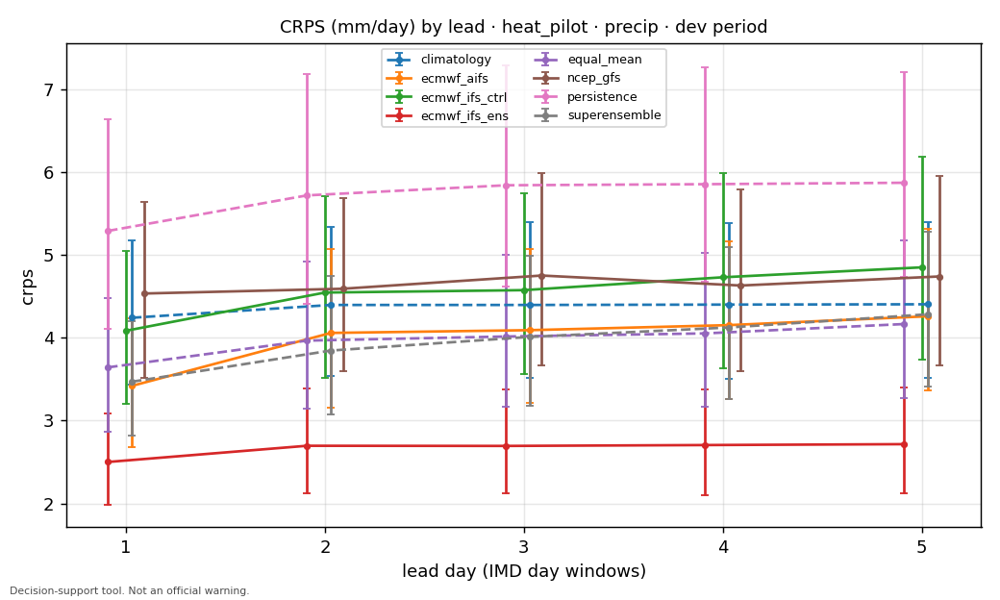
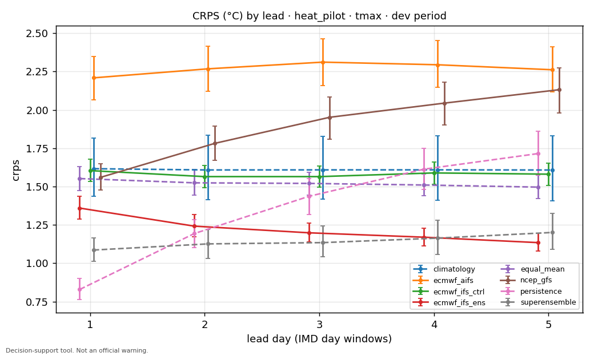
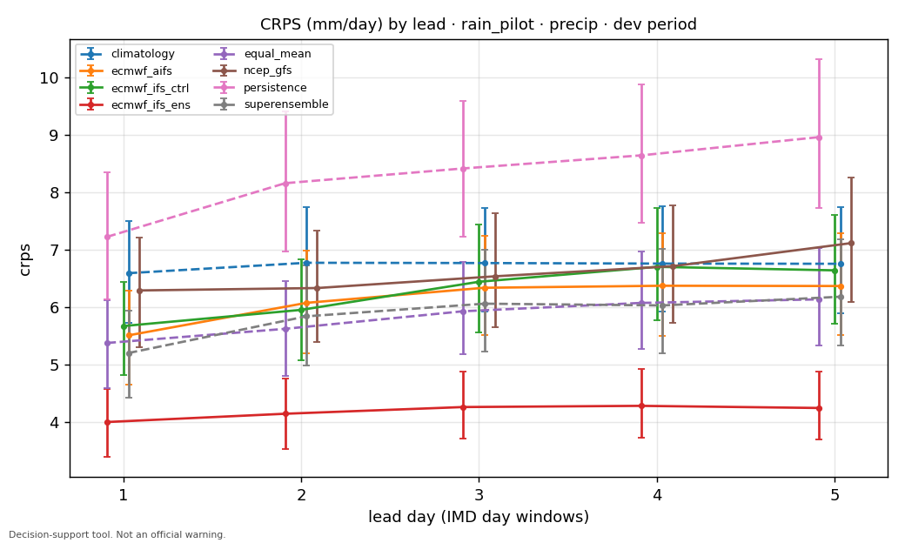
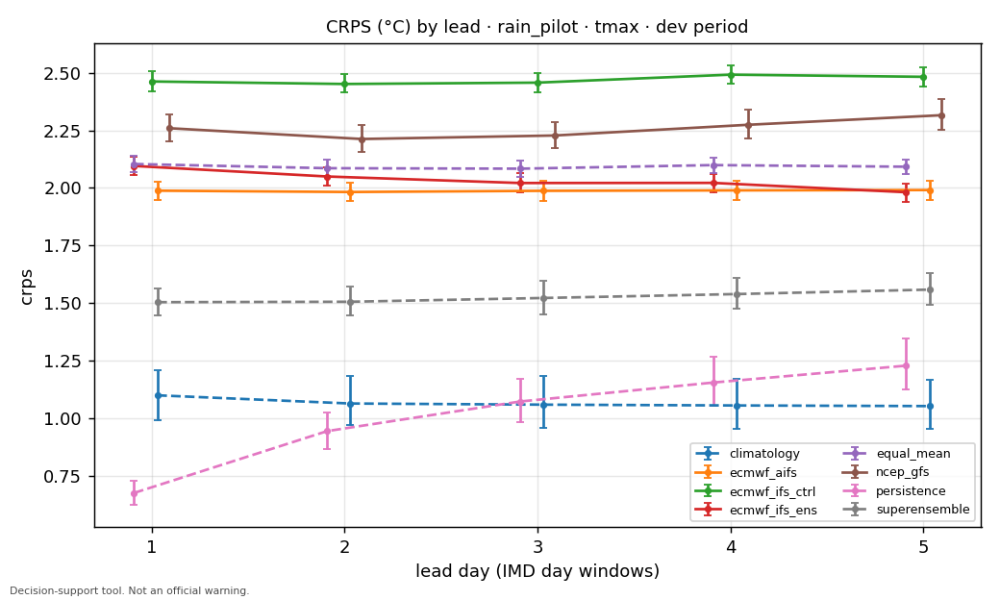
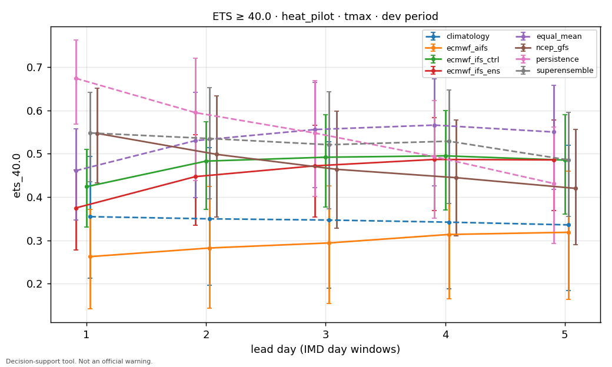
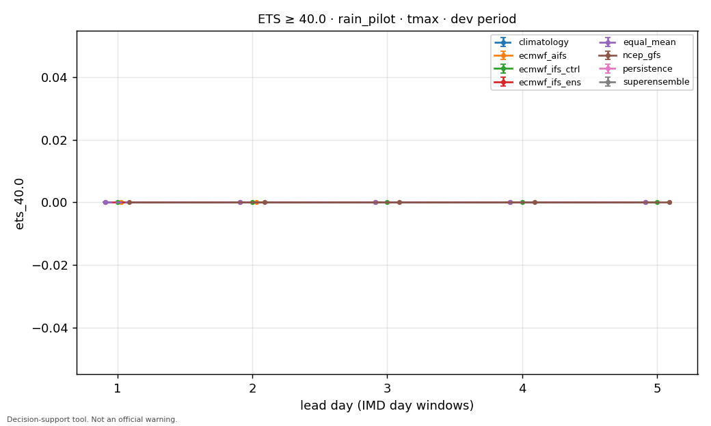
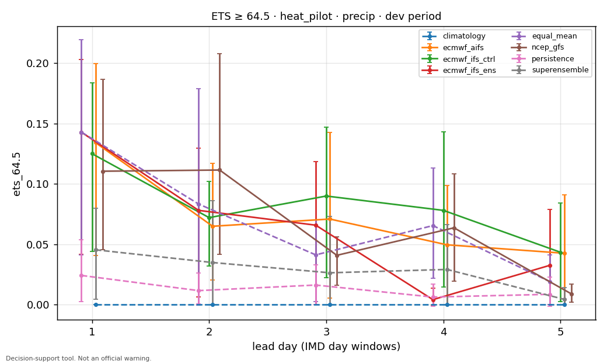
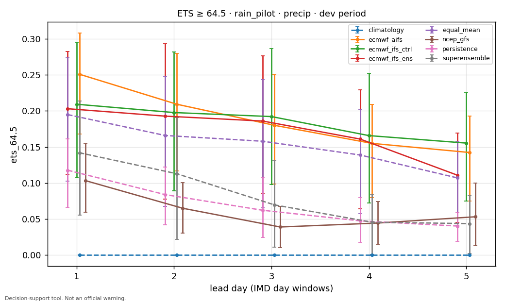
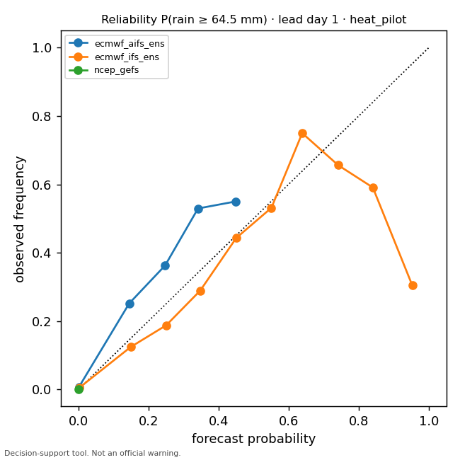
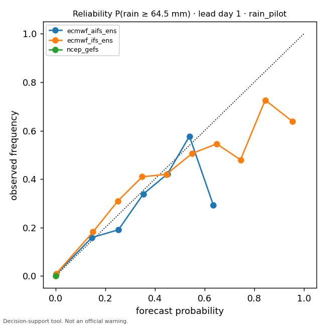
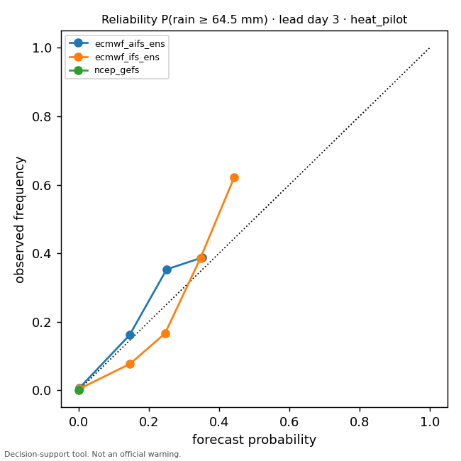
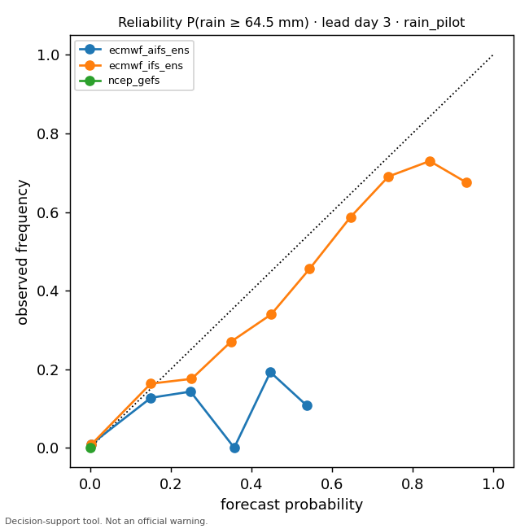
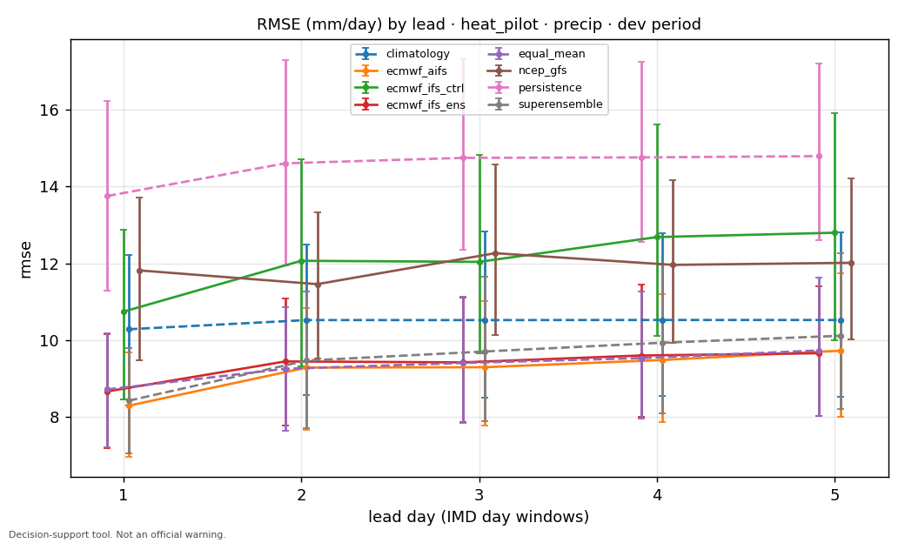
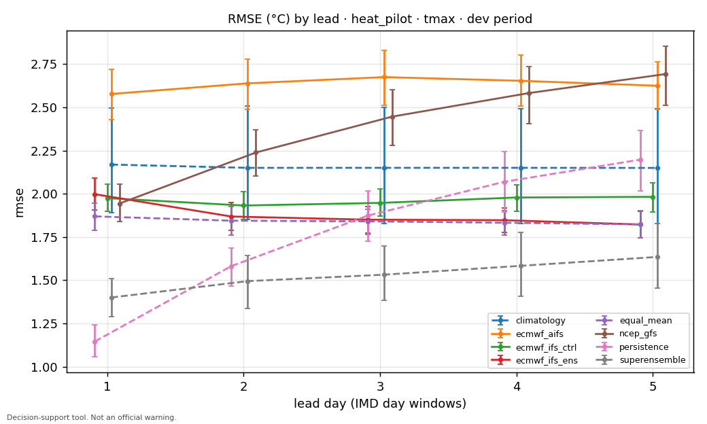
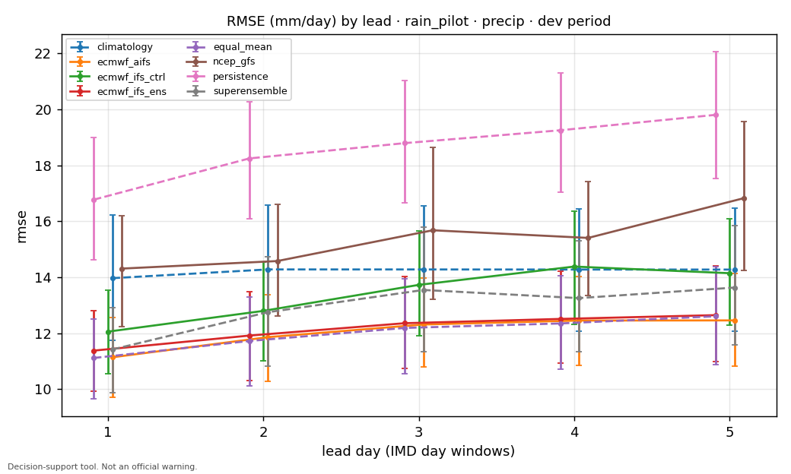
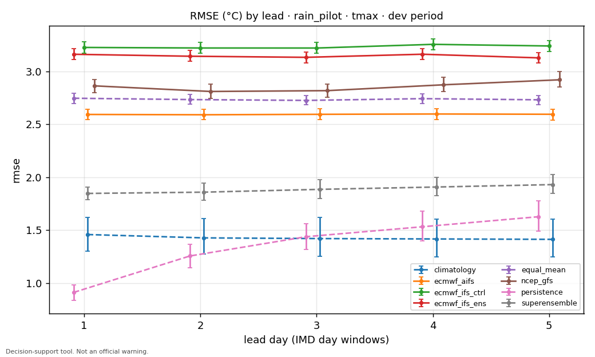

## Notes

- Climatology baseline available: {'rain_pilot/precip': True, 'rain_pilot/tmax': True, 'heat_pilot/precip': True, 'heat_pilot/tmax': True}. Without the 1991-2020 IMD normal on disk the
  climatology row and Brier skill scores are omitted rather than approximated.
- Previous Runs sources (ecmwf_ifs HRES, dwd_icon, cmc_gem) are ~11.5 h staler than true-init
  sources at the same lead (DATA_SOURCES.md).
- Ensemble CRPS is the fair CRPS; deterministic CRPS equals MAE.
- Season strata and full per-stratum results: `scoreboard_full.csv`.